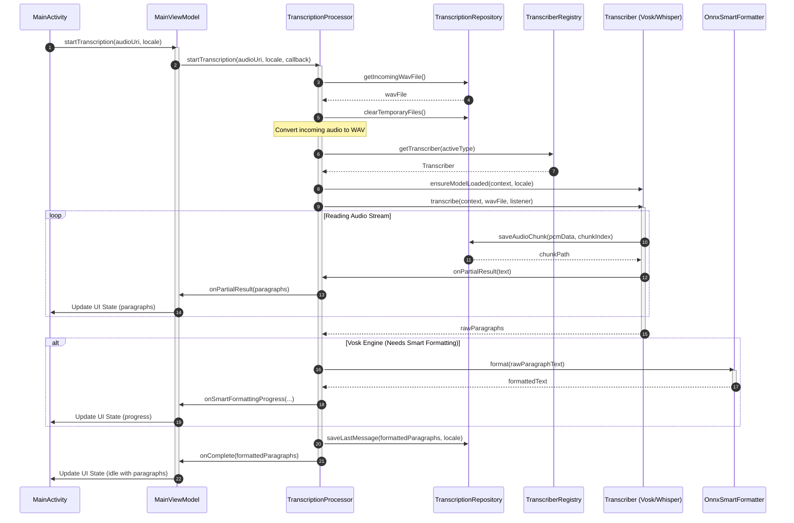

## Introduction

AintListening is designed as a secure, offline-first, private speech-to-text transcription engine for Android. It handles local transcription of shared audio files and enforces privacy by never uploading audio data or results to external servers.

To support this mission, the codebase is structured into highly cohesive, decoupled architectural layers. It utilizes **Dagger/Hilt** for dependency injection, provides an MVVM-oriented UI, encapsulates complex coordination inside a singleton domain processor, abstracts multiple speech-to-text libraries behind a single interface, and implements a sophisticated token-classification deep learning model via ONNX for intelligent formatting.

---

## Architectural Layers Overview

The application is structured into five core layers, each with strict boundaries and responsibilities:

1. **Presentation / UI Layer (MVVM)**: 
   Managed by standard Android Jetpack components. Activities (like `MainActivity`) are annotated with Hilt's `@AndroidEntryPoint` and interact with `MainViewModel` using standard `LiveData` observers to consume states (`MainUiState`) and display text in a paragraph-oriented `RecyclerView`.
2. **Domain / Orchestration Layer**:
   Centered on `TranscriptionProcessor`, a Hilt `@Singleton`. This layer defines the orchestrator that manages audio conversions, resolves transcription engines, triggers speech processing, manages thread boundaries, applies formatting, and notifies observers.
3. **Transcription Abstraction Layer**:
   Decoupled through the `Transcriber` interface and managed by `TranscriberRegistry`. Currently provides two distinct backends: `VoskTranscriber` (Vosk API) and `WhisperTranscriber` (whisper.cpp via a native wrapper).
4. **ONNX Post-Processing Layer**:
   Encapsulated by `OnnxSmartFormatter` implementing `SmartFormatter`. Uses the **ONNX Runtime (ORT)** and **HuggingFace Tokenizers** (via DJL) to perform deep-learning-based token classification for punctuation and capitalization restoration.
5. **Persistence & Assets Layer**:
   Driven by `Persistency` and `ModelManager`. Handles application configuration in `SharedPreferences` (per-locale engines, enabled states, display preferences), manages serialization of transcripts to local storage, handles downloaded models, and organizes file-system locations (cache and internal folders).

---

## Runtime Transcription Flow

The following sequence diagram illustrates the lifecycle and component interactions of an asynchronous transcription request starting from a shared audio intent in `MainActivity`:


Figure 1: End-to-end asynchronous transcription and smart formatting sequence in AintListening.

---

## Dependency Injection (Hilt/Dagger)

AintListening relies on **Dagger/Hilt** for compile-time dependency management, ensuring structured scope management and decoupling across layers. Singleton-scoped dependencies are explicitly declared inside `AppModule`, which is annotated with `@Module` and installed into Hilt's `SingletonComponent`:

* **`Persistency`**: Managed as a global singleton. It requires the `@ApplicationContext Context` to prevent memory leaks and provide persistent state, file system boundaries, and preference access.
  ```java
  @Provides
  @Singleton
  public static Persistency providePersistency(@ApplicationContext Context context) {
      return new Persistency(context);
  }
  ```
* **`TranscriberRegistry`**: Managed as a singleton, hosting registered speech engine implementations. This centralizes transcriber instances to prevent redundant allocations and coordinates full resource cleanup.
  ```java
  @Provides
  @Singleton
  public static TranscriberRegistry provideTranscriberRegistry(VoskTranscriber voskTranscriber, WhisperTranscriber whisperTranscriber) {
      return new TranscriberRegistry(voskTranscriber, whisperTranscriber);
  }
  ```

`TranscriptionProcessor` is similarly annotated with `@Singleton` and received by ViewModels (like `MainViewModel`) via constructor injection (annotated with `@HiltViewModel`).

---

## Detailed Component Architecture

### 1. Presentation Layer (MVVM)
* **`MainActivity`**: Serves as the user entry point. Handles incoming `audio/*` share intents (`Intent.ACTION_SEND`). If multiple language models are installed, it presents a Material design selection dialog.
* **`MainViewModel`**: Exposes a single `LiveData<MainUiState>` channel. It coordinates with the backend and converts progress, formatting, and results into a thread-safe UI state.
* **`MainUiState`**: An immutable representation of the UI's status, tracking `isLoading`, progress values, error messages, and the display list of `TranscriptionParagraph` objects.

### 2. Orchestration Layer (`TranscriptionProcessor`)

`TranscriptionProcessor` acts as the domain-level controller orchestrating the end-to-end audio pipeline.

* **Hilt Setup & Constructor Parameters**:
  It is registered as a `@Singleton` and instantiated using Hilt's `@Inject` constructor injection. The processor receives three constructor parameters:
  1. **`@ApplicationContext Context context`**: A leak-safe application context reference used to load assets, access local storage directories, and interact with Android components.
  2. **`TranscriptionRepository repository`**: The data layer manager used to clear files, transcode audio, save chunks, and persist results.
  3. **`TranscriberRegistry transcriberRegistry`**: The registry component resolved from the Dagger graph to dynamically acquire speech engines.

* **Execution Model (Single-Thread Executor)**:
  To avoid choking mobile resources, the class isolates CPU-intensive and I/O-bound processes from the main thread using an internal single-thread executor (`private final ExecutorService executorService = Executors.newSingleThreadExecutor()`). This enforces a FIFO sequential model, guaranteeing that only one transcription runs at any given time. Results and progressive status changes are passed back to the UI thread using an Android `Handler` bound to the main looper (`Looper.getMainLooper()`).

* **Sequential Orchestration Control Flow (`startTranscription`)**:
  When `startTranscription(audioUri, locale, callback)` is invoked, it schedules the following steps sequentially on the single-thread background executor:
  1. **Conversion Setup**: Dispatches a status callback update (`"Converting audio..."`). Reclaims disk space and purges older runs via `repository.clearTemporaryFiles()`, and resolves the new target audio file path via `repository.getIncomingWavFile()`.
  2. **Opus to WAV Transcoding**: Performs audio transcoding via `OpusToWavDecoder.decodeOpusToWav(context, audioUri, wavFile)`. If decoding fails (e.g., due to corrupt input or an inaccessible URI), it dispatches `notifyError` and aborts.
  3. **Engine Resolution**: Updates status to `"Loading model..."`. Resolves the `LanguageSupport` profile using `ModelManager.getLanguageSupport(locale)`. Identifies the active transcriber engine type based on user configurations and locale preferences via `language.getActiveTranscriberType(context, repository.getPersistency())`, and requests the concrete engine from `transcriberRegistry.getTranscriber(activeType)`.
  4. **Model Loading**: Prepares the selected model in memory by executing `activeTranscriber.ensureModelLoaded(context, locale)`.
  5. **Streaming Ingestion & Recognition**:
     - Sends `"Transcribing..."` state back to the UI.
     - Runs `activeTranscriber.transcribe(context, wavFile, listener)`.
     - The anonymous listener intercepts raw outputs:
       - **`onPartialResult` / `onResult`**: Translates text into paragraphs using `parseParagraphs(text, providesPunctuation)` and pushes UI updates on the main thread.
       - **`onAudioChunkAvailable`**: Intercepts active PCM bytes and writes sequential files on disk through `repository.saveAudioChunk(pcmData, chunkIndex)`.
  6. **Smart Formatting**: If the engine does not natively support punctuation and casing, and the user has enabled formatting, it initializes or reuses `OnnxSmartFormatter` and performs transformer-based text post-processing, posting progressive formatting updates via `notifySmartFormattingProgress`.
  7. **Result Persistence & Completion**: Saves the final transcript structure using `repository.saveLastMessage()` and completes the workflow by calling `onComplete()`.

* **Resource Management**:
  Implements `release()` to shut down native engines via `transcriberRegistry.closeAll()` and disposes of active ONNX/Tokenizer session objects in `smartFormatter`.

### 3. Transcription Engines

Decoupled through the `Transcriber` interface, speech-to-text engines must conform to uniform startup, transcription, and cleanup lifecycles:

```
                  ┌──────────────────────┐
                  │     Transcriber      │
                  └──────────┬───────────┘
                             │
              ┌──────────────┴──────────────┐
              ▼                             ▼
   ┌────────────────────┐        ┌────────────────────┐
   │  VoskTranscriber   │        │ WhisperTranscriber │
   └────────────────────┘        └────────────────────┘
```

#### The `Transcriber` Interface
Defined in `de.switchconsulting.aintlistening.transcription.Transcriber`, this interface exposes five essential capability boundaries:
1. `void ensureModelLoaded(Context context, Locale locale) throws Exception`: Verifies download status and initializes model structures.
2. `List<TranscriptionParagraph> transcribe(Context context, File wavFile, TranscriptionListener listener) throws Exception`: Executes the primary synchronous transcription. Tracks partial tokens and routes chunk buffers using the listener.
3. `TranscriberType getType()`: Identifies the underlying transcriber (VOSK vs WHISPER).
4. `boolean providesPunctuation()`: Returns whether the engine produces structured cased and punctuated outputs organically.
5. `void close()`: Deallocates native memory structures.

#### Role of `TranscriberRegistry`
The `TranscriberRegistry` is a thread-safe registry mapping `TranscriberType` values to their concrete implementations using an internal `EnumMap`.
* **Resolution**: Allows callers to dynamically resolve engines via `getTranscriber(type)`.
* **Teardown**: Encapsulates clean engine lifecycle management by exposing a `closeAll()` method. This loops over all registered engines and invokes `close()`, freeing underlying native buffers when the app or ViewModels are cleared.

---

### 4. ONNX Post-Processing (`OnnxSmartFormatter`)
The unpunctuated text produced by Vosk is post-processed in real time by the `OnnxSmartFormatter`. It uses a **multi-head token classification transformer model** (the 1-800-BAD-CODE XLM-RoBERTa architecture) running locally on Android via the **ONNX Runtime (ORT)**.

* **Initialization**: Loads `model.onnx` into an `OrtSession` and `tokenizer.json` into a HuggingFace `Tokenizer` (from the DJL Deep Java Library).
* **Inference**: Tokenizes the lowercased transcript to acquire `input_ids` and `attention_mask`. Executes `session.run()` to obtain four multi-head output arrays:
  1. `pre_preds`: Predictions for preceding punctuation (e.g., Spanish inverted question/exclamation marks `¿`, `¡`).
  2. `post_preds`: Predictions for succeeding punctuation (e.g., `.`, `,`, `?`, etc.). Includes a special acronym label (index 1) which inserts a period after every letter.
  3. `cap_preds`: Character-level capitalization predictions mapping exactly to character indices in SentencePiece tokens.
  4. `seg_preds` (Sentence Boundary Detection): Predictions identifying sentence boundaries to force capitalizing the next word.
* **Reconstruction**: An algorithm iterates through the SentencePiece tokens (detecting boundaries with `\u2581` prefixes), aggregates sub-tokens, applies character-level capitalization, handles special acronym layouts, prefixes pre-punctuation, appends post-punctuation, and capitalizes subsequent word boundaries.

---

### 5. Persistence & Local Storage Layout

The `Persistency` layer separates fast preference state from volatile audio caches:

#### SharedPreferences (`AintListeningPrefs`)
* Stores user configurations (e.g., whether to show copy or playback buttons, whether to default to raw or formatted text views).
* Stores per-locale preferences for transcriber engines (Vosk vs. Whisper) and locale-specific smart formatting toggles.
* **Paragraph Serialization & Deserialization**:
  To support instant UI restoration upon application restarts, `Persistency` serializes the active paragraph list to JSON:
  * **Serialization (`saveLastMessage`)**:
    Iterates through the list of `TranscriptionParagraph` structures and encodes each into a `JSONObject` containing:
    - `"raw"`: Raw unformatted text (`p.getRawText()`).
    - `"formatted"`: Structured formatted text (`p.getFormattedText()`).
    - `"showFormatted"`: Boolean preference mapping current paragraph view mode (`p.isShowFormatted()`).
    - `"audioPath"`: The absolute file path of the saved chunk (`p.getAudioFilePath()`).
    
    These objects are packed into a `JSONArray` and written as a serialized string under `last_paragraphs_json`. The language locale tag is similarly stored under `"last_locale_tag"`. The update is committed using `apply()` for asynchronous non-blocking storage performance.
    
  * **Deserialization (`loadLastMessage`)**:
    Reads the serialized string under `last_paragraphs_json`. If non-null, it instantiates a `JSONArray`, extracts individual `JSONObject` items, reconstructs the `TranscriptionParagraph` instances, retrieves the `showFormatted` flag via `optBoolean("showFormatted", p.isShowFormatted())`, and populates an array list to return to the caller.

#### File System Boundaries
* **Cache Directory (`context.getCacheDir()`)**: Holds the temporary `incoming_audio_16k_mono.wav` transcoded from WhatsApp or system intents.
* **Internal Files Directory (`context.getFilesDir()`)**:
  * Holds downloaded Vosk models (`vosk-model-small-...`) and Whisper GGML binary models (`ggml-tiny.bin`).
  * Holds the ONNX smart formatting model files (`ONNXModel_multilingual`).
  * Stores a dedicated `audio_chunks` directory where individual WAV files corresponding to transcription paragraphs (`chunk_X.wav`) are sequentially saved for local playback.
* **Cleanup**: `clearTemporaryFiles()` is systematically triggered at the start of a transcription workflow to delete the cached incoming WAV and purge old chunk folders.
