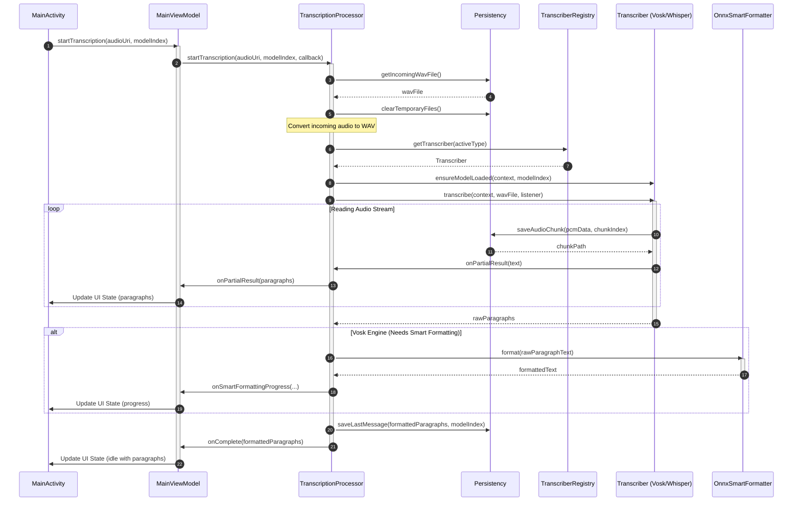

## Introduction

AintListening is designed as a secure, offline-first, private speech-to-text transcription engine for Android. It handles local transcription of shared audio files and enforces privacy by never uploading audio data or results to external servers.

To support this mission, the codebase is structured into highly cohesive, decoupled architectural layers. It utilizes **Dagger/Hilt** for dependency injection, provides an MVVM-oriented UI, encapsulates complex coordination inside a singleton domain processor, abstracts multiple speech-to-text libraries behind a single interface, and implements a sophisticated token-classification deep learning model via ONNX for intelligent formatting.

---

## Architectural Layers Overview

The application is structured into five core layers, each with strict boundaries and responsibilities:

1. **Presentation / UI Layer (MVVM)**: 
   Managed by standard Android Jetpack components. Activities (like `MainActivity`) are annotated with Hilt's `@AndroidEntryPoint` and interact with `MainViewModel` using standard `LiveData` observers to consume states (`MainUiState`) and display text in a paragraph-oriented `RecyclerView`.
2. **Domain / Orchestration Layer**:
   Centered on `TranscriptionProcessor`, a Hilt `@Singleton`. This layer defines the orchestrator that manages audio conversions, resolves transcription engines, triggers speech processing, manages thread boundaries, applies formatting, and notifies observers.
3. **Transcription Abstraction Layer**:
   Decoupled through the `Transcriber` interface and managed by `TranscriberRegistry`. Currently provides two distinct backends: `VoskTranscriber` (Vosk API) and `WhisperTranscriber` (whisper.cpp via a native wrapper).
4. **ONNX Post-Processing Layer**:
   Encapsulated by `OnnxSmartFormatter` implementing `SmartFormatter`. Uses the **ONNX Runtime (ORT)** and **HuggingFace Tokenizers** (via DJL) to perform deep-learning-based token classification for punctuation and capitalization restoration.
5. **Persistence & Assets Layer**:
   Driven by `Persistency` and `ModelManager`. Handles application configuration in `SharedPreferences` (per-locale engines, enabled states, display preferences), manages serialization of transcripts to local storage, handles downloaded models, and organizes file-system locations (cache and internal folders).

---

## Runtime Transcription Flow

The following sequence diagram illustrates the lifecycle and component interactions of an asynchronous transcription request starting from a shared audio intent in `MainActivity`:


Figure 1: End-to-end asynchronous transcription and smart formatting sequence in AintListening.

---

## Dependency Injection (Hilt/Dagger)

AintListening relies on **Dagger/Hilt** for dependency management. Singleton-scoped dependencies are configured inside `AppModule`, which is installed in Hilt's `SingletonComponent`:

* **`Persistency`**: Shared globally to provide preference state and cache access. It requires the `@ApplicationContext Context` for secure initialization.
* **`TranscriberRegistry`**: Managed as a singleton, hosting instances of registered speech engines to prevent repeated instantiation and ensure controlled cleanup.

`TranscriptionProcessor` is also annotated as a `@Singleton` and uses constructor injection to receive these shared components. ViewModels (like `MainViewModel`) are annotated with `@HiltViewModel` and receive the orchestrator via constructor injection.

---

## Detailed Component Architecture

### 1. Presentation Layer (MVVM)
* **`MainActivity`**: Serves as the user entry point. Handles incoming `audio/*` share intents (`Intent.ACTION_SEND`). If multiple language models are installed, it presents a Material design selection dialog.
* **`MainViewModel`**: Exposes a single `LiveData<MainUiState>` channel. It coordinates with the backend and converts progress, formatting, and results into a thread-safe UI state.
* **`MainUiState`**: An immutable representation of the UI's status, tracking `isLoading`, progress values, error messages, and the display list of `TranscriptionParagraph` objects.

### 2. Orchestration Layer (`TranscriptionProcessor`)
The coordinator abstracts all background processing. It operates an internal single-thread executor (`ExecutorService`) to isolate CPU-intensive AI and file I/O operations from the main thread.
* **Audio Transcoding**: Uses `OpusToWavDecoder.decodeOpusToWav` to parse incoming streams (e.g., WhatsApp Opus audio) and write a temporary 16kHz, 16-bit Mono WAV format file.
* **Workflow Control**: Resolves the active engine, ensures models are loaded, tracks partial outputs, forwards parsed paragraphs, triggers smart formatting post-processing, persists results, and invokes callbacks.
* **Resource Management**: Implements `release()` to safely dispose of active tokenizer resources, ORT sessions, and native speech engine contexts when ViewModels are cleared.

### 3. Transcription Engines
Decoupled through the `Transcriber` interface, speech-to-text engines must conform to uniform startup, transcription, and cleanup lifecycles:

```
                  ┌──────────────────────┐
                  │     Transcriber      │
                  └──────────┬───────────┘
                             │
              ┌──────────────┴──────────────┐
              ▼                             ▼
   ┌────────────────────┐        ┌────────────────────┐
   │  VoskTranscriber   │        │ WhisperTranscriber │
   └────────────────────┘        └────────────────────┘
```

* **`VoskTranscriber`**:
  * Integrates the Kaldi-based Vosk framework.
  * Vosk does not provide punctuation natively (`providesPunctuation()` returns `false`), indicating to the system that the post-processing smart formatting layer must be activated.
  * Reads the raw PCM stream from the WAV file (skipping the standard 44-byte header), pipes the buffer into the native `Recognizer`, and extracts partial/final transcriptions via JSON parsing.
  * Finalized segments trigger audio chunk persistence on the fly.
* **`WhisperTranscriber`**:
  * Integrates `whisper.cpp` using a native JNI wrapper (`com.redravencomputing.whispercore.Whisper`).
  * Natively generates punctuated and cased text (`providesPunctuation()` returns `true`).
  * Enables incremental updates by starting transcription in a separate thread and continuously polling native message logs (`whisper.getMessageLogs()`) at short intervals (100ms).
  * Parses timestamp segments matching `[HH:MM:SS.mmm --> HH:MM:SS.mmm] SegmentText`.
  * Implements a **silence-gap detection algorithm**: It merges consecutive lines into paragraphs but forces a paragraph boundary if it detects a significant silence gap (`silenceGapMs > 100`) AND the preceding word ends in a sentence-ending punctuation (., ?, !), or if the paragraph exceeds 400 characters.
  * Slices exact audio sub-segments from the source WAV file using JNI-provided timestamps (where 16kHz 16-bit Mono PCM equates to precisely 32 bytes per millisecond) and writes them to local WAV chunk files, aligning Whisper's chunk playbacks with Vosk's.

### 4. ONNX Post-Processing (`OnnxSmartFormatter`)
The unpunctuated text produced by Vosk is post-processed in real time by the `OnnxSmartFormatter`. It uses a **multi-head token classification transformer model** (the 1-800-BAD-CODE XLM-RoBERTa architecture) running locally on Android via the **ONNX Runtime (ORT)**.

* **Initialization**: Loads `model.onnx` into an `OrtSession` and `tokenizer.json` into a HuggingFace `Tokenizer` (from the DJL Deep Java Library).
* **Inference**: Tokenizes the lowercased transcript to acquire `input_ids` and `attention_mask`. Executes `session.run()` to obtain four multi-head output arrays:
  1. `pre_preds`: Predictions for preceding punctuation (e.g., Spanish inverted question/exclamation marks `¿`, `¡`).
  2. `post_preds`: Predictions for succeeding punctuation (e.g., `.`, `,`, `?`, etc.). Includes a special acronym label (index 1) which inserts a period after every letter.
  3. `cap_preds`: Character-level capitalization predictions mapping exactly to character indices in SentencePiece tokens.
  4. `seg_preds` (Sentence Boundary Detection): Predictions identifying sentence boundaries to force capitalizing the next word.
* **Reconstruction**: An algorithm iterates through the SentencePiece tokens (detecting boundaries with `\u2581` prefixes), aggregates sub-tokens, applies character-level capitalization, handles special acronym layouts, prefixes pre-punctuation, appends post-punctuation, and capitalizes subsequent word boundaries.

### 5. Persistence & Local Storage Layout
The `Persistency` layer separates fast preference state from volatile audio caches:

* **SharedPreferences (`AintListeningPrefs`)**:
  * Stores user configurations (e.g., whether to show copy or playback buttons, whether to default to raw or formatted text views).
  * Stores per-locale preferences for transcriber engines (Vosk vs. Whisper) and locale-specific smart formatting toggles.
  * Serializes/deserializes the final list of `TranscriptionParagraph` structures to a JSON array (`last_paragraphs_json`), allowing instant UI restorations on app restarts.
* **File System Boundaries**:
  * **Cache Directory (`context.getCacheDir()`)**: Holds the temporary `incoming_audio_16k_mono.wav` transcoded from WhatsApp or system intents.
  * **Internal Files Directory (`context.getFilesDir()`)**:
    * Holds downloaded Vosk models (`vosk-model-small-...`) and Whisper GGML binary models (`ggml-tiny.bin`).
    * Holds the ONNX smart formatting model files (`ONNXModel_multilingual`).
    * Stores a dedicated `audio_chunks` directory where individual WAV files corresponding to transcription paragraphs (`chunk_X.wav`) are sequentially saved for local playback.
  * **Cleanup**: `clearTemporaryFiles()` is systematically triggered at the start of a transcription workflow to delete the cached incoming WAV and purge old chunk folders.
