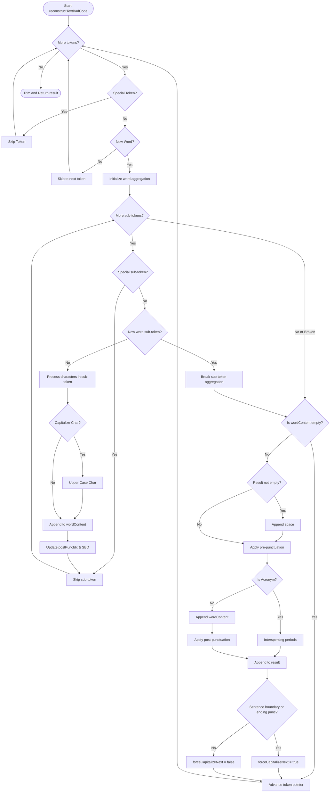

## Introduction

In automatic speech recognition (ASR) pipelines, lightweight local speech-to-text engines (such as Vosk) frequently output raw transcriptions that consist entirely of lowercase words without any punctuation, capitalization, or sentence boundaries. To transform this raw text stream into readable, grammatically correct paragraphs without violating user privacy by uploading voice data to external servers, AintListening implements an entirely offline, on-device Natural Language Processing (NLP) post-processing stack.

This stack is powered by an ONNX (Open Neural Network Exchange) multi-head token-classification model combined with a HuggingFace Tokenizer. By performing character-level capitalization, pre-punctuation, post-punctuation, and sentence boundary detection in a single inference pass, the smart formatting engine elevates raw transcripts to production-grade readable text locally on Android.

---

## Architectural Components

The on-device NLP stack consists of four key software components cooperating within the Android framework:

```
┌────────────────────────────────────────────────────────┐
│               TranscriptionProcessor                   │
│  (Coordinates transcription & incremental paragraphs)  │
└───────────────────────────┬────────────────────────────┘
                            │
                            ▼
┌────────────────────────────────────────────────────────┐
│                    SmartFormatter                      │
│        (Interface for post-processing text)            │
└───────────────────────────┬────────────────────────────┘
                            │
                            ▼
┌────────────────────────────────────────────────────────┐
│                  OnnxSmartFormatter                    │
│    (Orchestrates tokenization, inference, and merge)   │
├───────────────────────────┼────────────────────────────┤
│   HuggingFaceTokenizer    │        ONNX Runtime        │
│    (via DJL Tokenizers)   │ (OrtEnvironment/OrtSession)│
└───────────────────────────┴────────────────────────────┘
```

### 1. `SmartFormatter` (Interface)
Defines the standard boundary contract for text post-processing. It provides methods to apply formatting, query the underlying model's metadata via `ModelInfo`, and cleanly release memory resources on shutdown through `close()`.

### 2. `OnnxSmartFormatter` (Implementation)
The primary class orchestrating the post-processing pipeline. It handles the lifecycle of the underlying machine learning runtimes, coordinates tokenizer mappings, invokes model inference on background threads, and executes token-to-word reconstruction.

### 3. `OrtEnvironment` and `OrtSession` (ONNX Runtime)
Provides the execution engine for the serialized neural network.
* **`OrtEnvironment`**: A singleton instance representing the global ONNX Runtime state.
* **`OrtSession`**: A session created with specific options (e.g., thread counts) that loads the compiled model binary (`model.onnx`). It maps input tensors (`input_ids` and `attention_mask`) to output multi-head predictions.

### 4. `HuggingFaceTokenizer`
Leveraged via the Deep Java Library (DJL) tokenizers package, this component reads `tokenizer.json` to tokenize input text using the SentencePiece standard. It produces:
* Token IDs (`long[] inputIds`)
* Attention masks (`long[] attentionMask`)
* Raw token strings (`String[] tokens`), which contain prefix spaces (e.g., ` ` or `\u2581`) to mark word starting boundaries.

---

## Model Architecture & Multi-Head Predictions

AintListening utilizes an **XLM-RoBERTa**-based multi-head token classification model architecture, historically referred to as **1-800-BAD-CODE**. Unlike standard sequence labelers that predict a single label per token, this multi-head model outputs predictions across multiple linguistic dimensions simultaneously during a single inference pass.

When the input paragraph is tokenized and evaluated, the ONNX Session returns several coordinate matrices representing predictions:

### Pre-Punctuation (`pre_preds`)
Predicts punctuation marks that should appear *before* a given word. This is particularly relevant for languages like Spanish, which utilize inverted punctuation marks.
* **Label Mapping**: `{"", "¿", "¡"}`

### Post-Punctuation (`post_preds`)
Predicts punctuation marks that should appear *after* a given word. It also contains an acronym-expansion trigger at index 1.
* **Label Mapping**: `{"", "", ".", ",", "?", "？", "，", "。", "、", "・", "।", "؟", "፣", ";", "።", "፣", "፧"}`
* **Index 1 (`POST_PUNC_ACRONYM_INDEX`)**: Serves as a metadata flag indicating the token belongs to an acronym.

### Capitalization Predictions (`cap_preds`)
Character-level capitalization predictions mapped to individual character indices of each sub-token. Because ONNX output layers can vary depending on compilation optimizations, `OnnxSmartFormatter` dynamically handles multiple Java array types when extracting predictions from the ORT result, safely converting them into a standardized 3D long array (`[batch][sequence_length][character_index]`):
* `long[][][]` (Direct 3D representation)
* `int[][][]` / `boolean[][][]` (Upcasted to standard long indices)
* `long[][]` / `int[][]` (Reshaped by appending a default depth index of 1 for sequence-level outputs)

### Sentence Boundary Detection (`seg_preds` / `sbdPreds`)
Predicts whether a sub-token represents a boundary ending the current sentence (SBD). This ensures that even if a traditional sentence-ending punctuation mark is absent or modified, the formatting engine knows to force-capitalize the start of the next logical segment.

---

## Word Reconstruction and Aggregation (`reconstructTextBadCode`)

The core of the post-processing stack is the reconstruction algorithm implemented in `OnnxSmartFormatter.reconstructTextBadCode()`. It loops through the token array to group sub-tokens into complete words, while simultaneously applying character-level capitalization, pre-punctuation, post-punctuation, sentence-segment boundaries, and acronym rules.


*Figure 1: Token-merging and multi-head prediction reconstruction state machine.*

### Step-by-Step Word-Building Pipeline

1. **Token Filtering & Word Boundaries**:
   * Special tokens (e.g. `<s>`, `</s>`, `<pad>`, `[CLS]`, `[SEP]`, `<unk>`) are ignored.
   * SentencePiece uses ` ` or `\u2581` to denote a new word boundary. If a token begins with one of these characters, it triggers a forward-peeking aggregation loop.
2. **Sub-Token Aggregation (Word Merging)**:
   * The peeking loop collects succeeding sub-tokens that do not begin with a new word marker.
   * This handles word splits correctly, treating tokens like `[" be", "sorge", "n"]` as a single aggregated word `"besorgen"`.
3. **Character-Level Capitalization**:
   * For every character index `k` in raw sub-token `j`, the character-level capitalization prediction (`cap_preds[j][k]`) is checked.
   * If a prefix space is marked for capitalization, a `capNext` state is set to true to uppercase the subsequent alphabetical character.
   * If the character index itself is marked, `capNext` is true, or if `forceCapitalizeNext` is active at the start of a word, `Character.toUpperCase()` is applied.
4. **Pre-Punctuation Attachment**:
   * If `pre_preds[i]` points to an active Spanish marker (`¿` or `¡`), that punctuation is prepended to the aggregate word before spelling out the characters.
5. **Acronym Interspersing**:
   * If a post-punctuation prediction points to `POST_PUNC_ACRONYM_INDEX` (index 1), the engine formats the aggregated string as an acronym.
   * For example, the characters in the word `"usa"` (capitalized to `"USA"`) are interspersed with periods, resulting in `"U.S.A."`.
6. **Post-Punctuation and Sentence Boundaries**:
   * If the aggregated word is not an acronym, the selected post-punctuation index is retrieved from the final sub-token of the aggregated block and appended (e.g. `.`, `,`, `?`).
   * If the punctuation is a sentence-ending mark (`.`, `?`, `:`) or if any sub-token in the aggregate block had sentence boundary detection (`sbdPreds[j] == 1`) flagged, `forceCapitalizeNext` is set to `true`. This causes the next aggregated word to begin with an uppercase letter.

---

## Ingesting and Processing Text Increments

To maintain high responsiveness and prevent the UI thread from freezing on large transcriptions, smart formatting is applied **incrementally** per paragraph inside the background execution thread of `TranscriptionProcessor`.

```
Raw Transcription State ──> Parsed Paragraphs ──> Incremental Loop
                                                        │
         ┌──────────────────────────────────────────────┴───────────────┐
         ▼                                                              ▼
[Empty Paragraph] (Skipped)                                  [Active Text Paragraph]
                                                                        │
                                                                        ▼
                                                             Load model and tokenizer
                                                             (If first pass or language changed)
                                                                        │
                                                                        ▼
                                                             Format via OnnxSmartFormatter
                                                                        │
                                                                        ▼
                                                             Update progress callback
                                                             (Partial formatted list to UI)
```

1. **Paragraph Generation**:
   * As raw transcription results flow from the underlying engine, they are parsed into individual paragraph segments (`TranscriptionParagraph`), representing text separated by newlines.
2. **Orchestrated Evaluation**:
   * `TranscriptionProcessor` evaluates if formatting should run based on configuration checks:
     * Does the active `Transcriber` engine already provide built-in punctuation? (e.g. Whisper natively outputs casing, Vosk does not).
     * Has the user enabled smart formatting in the preferences for the active locale?
     * Is the language's smart formatting ONNX model fully downloaded onto local storage?
3. **Model Warm-Up & Reuse**:
   * To minimize latency, `OnnxSmartFormatter` is cached. If a model is already active and matches the current target language, it is reused. If the user changes target languages, the previous session is cleanly closed, and a new ONNX session and tokenizer are initialized.
4. **Sequential Chunk-Based Execution**:
   * Each parsed paragraph is sent to the formatter sequentially.
   * After each paragraph is formatted, the processor updates the UI through `onSmartFormattingProgress(currentStep, totalSteps, formattedList)`. This allows the interface to update in real-time, showing formatted paragraphs as they complete rather than blocking until the entire transcript is processed.
5. **Fail-safe Fallback**:
   * If the post-processing engine encounters an out-of-memory exception, a file loading error, or a tensor dimensions mismatch, the exception is caught, and the raw unpunctuated text is cleanly substituted as a fallback. This guarantees that punctuation failure never crashes the application or blocks transcript delivery.

---

## Testing Framework & Mock Assertions

Unit testing for the smart formatting engine is implemented in `SmartFormatterTest` using standard JUnit 4. Since `OnnxSmartFormatter` leverages the Android framework class `TextUtils`, which is unavailable during local JVM execution, Mockito static mocks are used to stub core utility methods.

### 1. Mocking TextUtils
The setup stub maps `TextUtils.isEmpty()` to evaluate the native standard library logic, preventing `NullPointerException` or mock-stub errors:

```java
@Before
public void setUp() {
    textUtilsMock = mockStatic(TextUtils.class);
    textUtilsMock.when(() -> TextUtils.isEmpty(any())).thenAnswer(invocation -> {
        CharSequence s = invocation.getArgument(0);
        return s == null || s.isEmpty();
    });
}
```

### 2. Asserting Sub-Token Word Splitting
To verify that sub-tokens are compiled and aggregated properly across word boundaries, the test passes split SentencePiece tokens with character predictions.
* **Input Tokens**: `{" be", "sorge", "n", " morgen"}`
* **Predictions**:
  * Capitalize the first letter of `" be"`.
  * Apply post-punctuation period (`.`) on the sub-token `"n"`.
  * Apply Sentence Boundary Detection (`SBD = 1`) on `"n"`.
* **Assertion**: Verifies that the aggregate yields `"Besorgen. Morgen"` — validating both sub-token stitching and SBD-driven capitalization on the subsequent word.

### 3. Asserting German Noun Capitalization
German nouns must be capitalized even when positioned in the middle of a sentence, whereas verbs and pronouns remain lowercase.
* **Input Tokens**: `{" ich", " gehe", " ins", " büro"}`
* **Predictions**: Capitalization prediction (`cap_preds`) flagged exclusively for the index representing `'b'` in `" büro"`.
* **Assertion**: Verifies the output matches `"Ich gehe ins Büro"`, ensuring that the default sentence-starting capitalization forces `"Ich"` uppercase, while the character-level predictions correctly isolate `"Büro"`.

### 4. Asserting Acronym Formatting
Validates the special-case formatting rule when the acronym index is predicted.
* **Input Tokens**: `{" die", " usa"}`
* **Predictions**: Post-punctuation index for `" usa"` is set to `POST_PUNC_ACRONYM_INDEX` (1).
* **Assertion**: Verifies the output compiles into `"Die U.S.A."`, confirming that individual characters of `"usa"` are successfully capitalized and interspersed with periods.

---

## Related Documents
* [System Architecture Overview](/openwiki/architecture/overview.md)
* [Ingestion and Processing Workflows](/openwiki/workflows/ingestion-and-processing.md)
