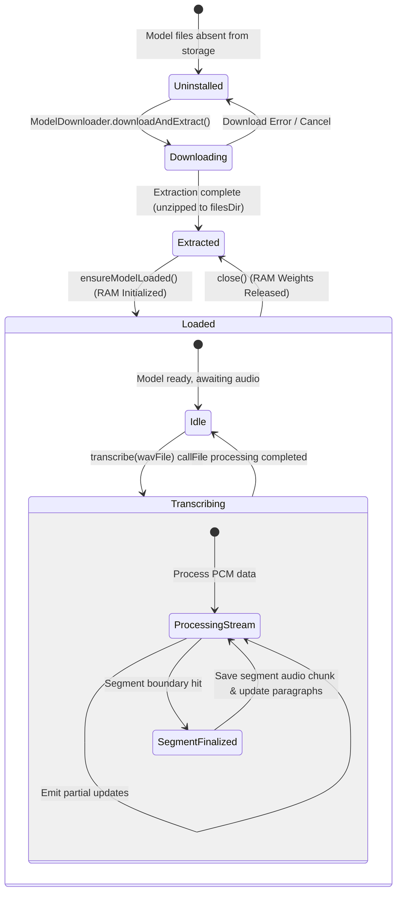

## Overview

AintListening is designed with a strict offline-first, privacy-respecting architecture. To guarantee maximum data privacy and absolute security, all speech-to-text processing occurs natively on the user's Android device. The application does not utilize or connect to any cloud-based transcription API.

To support this model, AintListening features a multi-engine local transcription framework that abstracts speech-to-text engines behind a common interface. The application currently supports two local transcribers:
1. **Vosk**: An extremely fast, lightweight speech-to-text engine ideal for resource-constrained devices, returning text without built-in punctuation.
2. **Whisper**: A state-of-the-art transformer-based speech recognition model (implemented via native C++ `whisper.cpp` bindings) that provides highly accurate transcription complete with native punctuation and capitalization.

This document describes the dynamic resolution, lifecycle, execution loop, and audio parsing mechanisms of these local transcription engines.

---

## Dynamic Resolution via TranscriberRegistry

The orchestration and invocation of transcription engines are decoupled from their concrete implementations using the `TranscriberRegistry`. Located in the transcription package, the registry is configured as a Hilt/Dagger `@Singleton` with constructor dependency injection.

```java
@Singleton
public class TranscriberRegistry {
    private final Map<TranscriberType, Transcriber> transcribers = new EnumMap<>(TranscriberType.class);

    @Inject
    public TranscriberRegistry() {
        transcribers.put(TranscriberType.VOSK, new VoskTranscriber());
        transcribers.put(TranscriberType.WHISPER, new WhisperTranscriber());
    }

    public Transcriber getTranscriber(TranscriberType type) {
        return transcribers.get(type);
    }

    public void closeAll() {
        for (Transcriber transcriber : transcribers.values()) {
            transcriber.close();
        }
    }
}
```

### Key Responsibilities
* **Decoupled Mapping**: Maps `TranscriberType` keys (`VOSK` or `WHISPER`) to active `Transcriber` instances inside an `EnumMap`.
* **Runtime Resolution**: Exposes `getTranscriber(TranscriberType type)` to allow dynamic resolution of engines by the `TranscriptionProcessor` orchestrator based on user configuration.
* **Lifecycle Shutdown**: Offers a central `closeAll()` hook called when the application or core processing loop terminates, releasing native memory and file handles.

---

## The Transcriber Interface & Lifecycle

The `Transcriber` interface defines the contract that any local transcription service must fulfill. This keeps engine implementations interchangeable and allows seamless expansion to other local engines (e.g., Sherpa-ONNX) in the future.

```java
public interface Transcriber {
    void ensureModelLoaded(Context context, int modelIndex) throws Exception;
    
    List<TranscriptionParagraph> transcribe(Context context, File wavFile, TranscriptionListener listener) throws Exception;
    
    TranscriberType getType();
    
    int getNameResId();
    
    boolean providesPunctuation();
    
    void close();
}
```

### Core Lifecycle Methods

The lifecycle of an active transcriber revolves around three phases:

#### 1. Model Memory Allocation (`ensureModelLoaded`)
Before any audio is passed to an engine, its binary model weights (which may range from 40 MB to over 100 MB) must be loaded into memory. This method performs the following tasks:
* Asserts whether the requested model files exist in the internal storage (`context.getFilesDir()`).
* If not present, it fails fast by throwing an `IllegalStateException` (meaning the model must be downloaded via `ModelDownloader` first).
* Instantiates the underlying engine handles (e.g., `new Model()` in Vosk, or `whisper.initializeModel()` in Whisper) and blocks until the model is ready in RAM.
* Cache Verification: Avoids redundant re-loading if the requested engine and model index match the already-loaded model weights.

#### 2. Execution & Stream Processing (`transcribe`)
Executes the main transcription pass on an input 16kHz WAV file.
* Reads the file, skipping headers if necessary, and stream-processes the PCM data.
* Fires callback methods on the `TranscriptionListener`:
  - `onPartialResult(String text)`: Returns ongoing interim transcriptions to keep the user interface responsive.
  - `onAudioChunkAvailable(byte[] pcmData, int chunkIndex)`: Saves processed audio segments into persistent cache files to support paragraph-level playback.
  - `onResult(String text)`: Updates the full final cumulative text transcript.
* Returns a list of `TranscriptionParagraph` structures containing text, timing data, and local cache paths of the saved audio chunks.

#### 3. Native Resource Cleanup (`close`)
Since both Vosk and Whisper rely on underlying C/C++ native libraries loaded via JNI, managing heap memory alone is insufficient. Calling `close()` explicitly:
* Unloads loaded model structures (e.g., calling JNI-bound `model.close()` for Vosk or `whisper.cleanup()` for Whisper).
* Releases JNI global references.
* Resets cached model state and index tracking variables back to unloaded defaults.

---

## Model Statuses & Transition States

AintListening manages speech model lifecycle states on disk and in memory. Models start in an uninstalled state, transition through download and extraction, and are eventually loaded into RAM by the appropriate transcriber.

The following state machine tracks these statuses and the transitions driven by the user and engine lifecycles:


Figure 1: State machine representing model installation, RAM loading, and transcriber execution states.

---

## Vosk vs. Whisper: Architectural Comparison

While both engines share the `Transcriber` abstraction, they are built on entirely different design patterns and runtime APIs.

| Feature / Metric | Vosk Engine (`VoskTranscriber`) | Whisper Engine (`WhisperTranscriber`) |
| :--- | :--- | :--- |
| **Underlying Lib** | Vosk API (Kaldi-based) | Whisper.cpp (C++ Port of OpenAI Whisper) |
| **API Mechanism** | Synchronous push-buffer | Asynchronous native delegates |
| **Segment Handling**| On-the-fly JSON responses | Message log polling + timestamp parsing |
| **Audio Slicing** | Progressive accumulation during read | Precise random-access file seeks |
| **Casing & Punctuation**| No (needs `OnnxSmartFormatter` post-processing) | Yes (natively resolved by transformer) |
| **Core Model Size** | Small (~40-48 MB) | Lightweight (~75 MB) |

### Vosk Engine Implementation Details

`VoskTranscriber` runs a synchronous loop that pushes raw PCM bytes directly into a Vosk `Recognizer`. 

#### 1. Parsing JSON Results
Vosk returns intermediate outputs as JSON-formatted strings. The transcriber extracts text using JSON parsers:
* **Partial Text**: Polled using `recognizer.getPartialResult()`. The transcriber extracts the `"partial"` key:
  ```json
  { "partial": "this is a partial" }
  ```
* **Finalized Segment**: Triggered when Vosk detects a speech pause. Polled using `recognizer.getResult()`. The transcriber extracts the `"text"` key:
  ```json
  { "text": "this is a finalized segment" }
  ```

#### 2. Vosk Audio Chunk Saving
To support paragraph-level playback, `VoskTranscriber` implements progressive audio accumulation:
* During file reads, raw PCM bytes (minus the 44-byte WAV header) are continually written into a `ByteArrayOutputStream currentPcm`.
* Whenever a segment is finalized via `acceptWaveForm(buffer, nread)`, the transcriber takes the accumulated bytes from `currentPcm`, triggers `listener.onAudioChunkAvailable(currentPcm.toByteArray(), chunkIndex++)`, and resets `currentPcm` to zero.
* This matches the audio chunk precisely to the finalized Vosk paragraph segment.

---

### Whisper Engine Implementation Details

`WhisperTranscriber` delegates transcription to a native C++ engine via `com.redravencomputing.whispercore.Whisper`. It operates asynchronously, requiring custom polling, parsing, and random-access audio slicing.

#### 1. Native Integration & Delegate API
The transcription is initiated with:
```java
whisper.transcribeAudioFile(wavFile, /* keepTimestamps */ true, /* printLogs */ true);
```
Results are delivered asynchronously via `WhisperDelegate` callbacks (`didTranscribe(text)` or `failedToTranscribe(error)`). The transcriber uses a `CompletableFuture<String>` to block the executing thread until the transcription finishes or times out.

#### 2. Log Polling for Incremental Updates
Because the C++ engine writes transcription progress directly to a internal message log buffer, `WhisperTranscriber` runs a background thread polling loop.
* Every `INCREMENTAL_UPDATE_POLLING_INTERVALL_MS` (100 ms), it calls `whisper.getMessageLogs()`.
* It compares the message logs against the previous line count and processes newly added lines.
* Each segment line matches a strict regex pattern representing timestamp boundaries:
  ```regex
  \[(\d{2}:\d{2}:\d{2}\.\d{3})\s*-->\s*(\d{2}:\d{2}:\d{2}\.\d{3})]\s*(.*)
  ```
  Example line: `[00:00:01.230 --> 00:00:04.560]  Hello world.`

#### 3. Paragraph Splitting & Silence Detection
Unlike Vosk, which decides on segment boundaries internally, `WhisperTranscriber` manages paragraph splitting rules:
* **Significant Silence Gap**: Compares the start timestamp of the current segment against the end timestamp of the previous segment. If the difference is greater than `SILENCE_GAP_MS` (100 ms), it qualifies as a silence gap.
* **Sentence Boundaries**: Checks if the active text ends with punctuation (`.`, `?`, `!`).
* **Triggering a Split**: A new paragraph is created when:
  1. A significant silence gap occurs at the end of a sentence.
  2. The current paragraph buffer exceeds 400 characters and ends with a sentence-ending punctuation mark.

#### 4. Precise WAV Audio Slicing
When a paragraph split is triggered, Whisper extracts the corresponding raw audio segment directly from the source WAV file. It performs a precise byte-calculation based on timing indices:
* **Audio Format**: 16kHz sample rate, 16-bit Mono PCM.
* **Byte Offset Calculation**: 
  - Each sample is 16 bits (2 bytes).
  - 16,000 samples per second = 16 samples per millisecond.
  - `16 samples/ms * 2 bytes/sample = 32 bytes/ms`.
* **Random-Access Seek**:
  The transcriber opens the source file in read-only mode via a `RandomAccessFile` and seeks to:
  $$\text{Start Byte} = 44 \text{ (WAV Header)} + (\text{Start Millisecond} \times 32)$$
  $$\text{End Byte} = 44 \text{ (WAV Header)} + (\text{End Millisecond} \times 32)$$
* The exact slice is read from disk, converted to a byte array, and sent to `listener.onAudioChunkAvailable(pcm, chunkIndex++)` to be stored in cache.

---

## Technical Summary of Engine Implementations

To ensure proper integration and maintenance, developers should note the following properties of each transcriber:

```java
// VoskTranscriber configuration properties
@Override
public TranscriberType getType() {
    return TranscriberType.VOSK;
}

@Override
public int getNameResId() {
    return R.string.engine_vosk;
}

@Override
public boolean providesPunctuation() {
    return false; // Requires subsequent smart formatting
}
```

```java
// WhisperTranscriber configuration properties
@Override
public TranscriberType getType() {
    return TranscriberType.WHISPER;
}

@Override
public int getNameResId() {
    return R.string.engine_whisper;
}

@Override
public boolean providesPunctuation() {
    return true; // Transformer natively restores casing and punctuation
}
```

---

## Related Pages

* [System Architecture Overview](/openwiki/architecture/overview.md) — Describes the overall layering and interaction with the orchestrator `TranscriptionProcessor`.
* [Smart Formatting Model](/openwiki/concepts/smart-formatting.md) — Details the deep-learning ONNX model used to restore punctuation and casing on Vosk transcripts.
