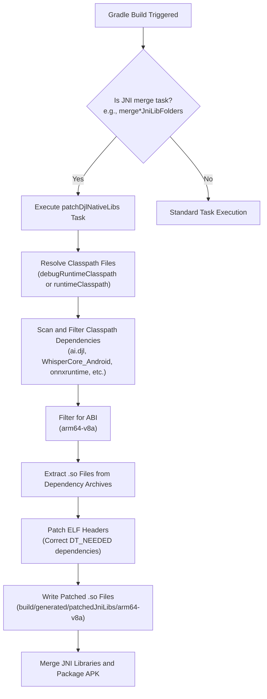

## Executive Summary

AintListening relies heavily on offline, local deep learning models for high-performance, private speech-to-text transcription. To run models like **Whisper** (via a native C++ wrapper), **Vosk** (Kaldi-based), and **ONNX Runtime/HuggingFace Tokenizers** (via Deep Java Library), the application must load and execute multiple complex native (`.so`) libraries through Java Native Interface (JNI). 

Managing prebuilt, third-party native libraries inside an Android application introduces significant packaging, linker compatibility, and runtime execution challenges. This document provides an in-depth operational guide on the Gradle build setup, NDK ABI filtering, dynamic JNI library packaging configurations, and the custom **ElfPatcherTask** (`patchDjlNativeLibs`) required to ensure execution stability on 64-bit Android platforms.

---

## NDK and Packaging Architecture

The Android build process is configured within `/build.gradle` to selectively compile, package, and optimize native library binaries.

### 1. 64-Bit ABI Targeting

To run complex transformer-based weights and deep learning inference engines efficiently, older 32-bit CPU architectures (like `armeabi-v7a` and `x86`) are excluded. The application exclusively compiles and targets modern, high-performance 64-bit architectures using `ndk.abiFilters`:

```gradle
ndk {
    abiFilters "arm64-v8a", "x86_64"
}
```

* **`arm64-v8a`**: The primary target for physical Android mobile devices and tablets, allowing native SIMD operations (NEON) and accelerating tensor operations.
* **`x86_64`**: Targeted to support hardware-accelerated execution within Android Virtual Devices (AVD) and emulators during development.

### 2. Legacy JNI Packaging Configuration

Modern Android Gradle Plugins (AGP) default to packing native libraries uncompressed inside the APK (`useLegacyPackaging = false`), letting the OS load them directly via memory mapping (`mmap`). However, AintListening enforces legacy packaging within the `jniLibs` block:

```gradle
packaging {
    jniLibs {
        useLegacyPackaging = true
        ...
    }
}
```

* **Rationale**: Several third-party engines (such as Vosk, certain DJL tokenizers, and Whisper C++ libraries) rely on runtime file extraction or dynamic JNI library loaders that are incompatible with direct memory-mapped loading from compressed APK packages.
* **Effect**: Enforcing `useLegacyPackaging = true` ensures that the Android package manager extracts `.so` files into the application’s private native library directory (`/data/app/.../lib/`) during installation, allowing the runtime dynamic linker (`ld`) to resolve symbols and paths using traditional file-system access.

### 3. Native Dependency Conflict Resolution

Because multiple transcribers and tokenizers are packaged together, transitive dependencies often introduce duplicate native binaries. These conflicts are resolved using specific `pickFirsts` patterns:

```gradle
pickFirsts += [
        '**/libdjl_tokenizer.so',
        '**/libggml-base.so',
        '**/libggml-cpu.so',
        '**/libggml.so',
        '**/libomp.so',
        '**/libwhisper-jni.so',
        '**/libwhisper.so'
]
```

* **`libomp.so`**: The OpenMP (Open Multi-Processing) runtime library used to parallelize CPU calculations, which is bundled separately by ONNX Runtime, GGML, and Whisper.
* **`libggml*.so` and `libwhisper*.so`**: Core shared libraries that form the backbones of the Whisper inference pipeline.
* **Operational Impact**: Without `pickFirsts`, the Android build system will throw a duplicate packaging error and abort. `pickFirsts` instructs AGP to use the first binary encountered on the build classpath, preventing compilation failures.

---

## The ElfPatcherTask (`patchDjlNativeLibs`)

The core of AintListening's native stability on physical 64-bit devices is the **ElfPatcherTask**, run via the Gradle task `patchDjlNativeLibs`.

### 1. The Challenge of Third-Party Native Binaries

Prebuilt `.so` libraries bundled inside standard JVM Maven dependencies (specifically Deep Java Library, ONNX Runtime, and custom Whisper wrappers) are often compiled with toolchains that target standard Linux or use custom linker flags. On modern, secure Android versions (API 23+), the system dynamic linker enforces strict ELF rules:
* All dependencies declared in the ELF headers (the `DT_NEEDED` entries) must be present and correctly named.
* The internal `SONAME` entry inside the ELF binary must match the actual file name.
* Linker namespace constraints prohibit loading libraries that have relative search paths (`DT_RUNPATH` / `DT_RPATH`) referencing host or forbidden directories.

When these constraints are violated, the application throws an immediate `java.lang.UnsatisfiedLinkError` upon calling `System.loadLibrary()`, causing the application to crash.

### 2. Task Mechanics and Configuration

To resolve this, the custom `ElfPatcherTask` automatically extracts and patches native files at compile time.

```gradle
import de.switchconsulting.elfpatcher.ElfPatcherTask

tasks.register('patchDjlNativeLibs', ElfPatcherTask) {
    outputDir.set(file("${project.layout.buildDirectory.get().asFile}/generated/patchedJniLibs/arm64-v8a"))
    
    def cpName = project.configurations.any { it.name == "debugRuntimeClasspath" } ? "debugRuntimeClasspath" : "runtimeClasspath"
    classpathFiles.set(project.configurations.named(cpName).map { it.incoming.files })
    runtimeConfiguration.set(project.configurations.named(cpName))

    libraryIncludes.add('ai.djl')
    libraryIncludes.add('WhisperCore_Android')
    libraryIncludes.add('onnxruntime')
    libraryIncludes.add('EberronBruce')
    libraryIncludes.add('vosk-android')
    
    abiFilter.set('arm64-v8a')
}
```

The task executes the following processing pipeline:
1. **Dependency Analysis**: Inspects the runtime classpath configurations (`debugRuntimeClasspath` or `runtimeClasspath`) to find JARs or AARs matching the declared target patterns in `libraryIncludes`.
2. **Binary Extraction**: Extracts `.so` files that match the requested `abiFilter` (`arm64-v8a`) out of these dependencies.
3. **ELF Header Modification**: Mutates the extracted binaries' ELF structures to:
   * Re-write or clean up `DT_NEEDED` entries so that libraries properly point to correct relative names (e.g., ensuring dependencies on OpenMP or standard libraries resolve correctly inside the Android environment).
   * Rectify missing or malformed `SONAME` records.
   * Strip or correct problematic `RUNPATH` properties that violate Android linker namespace rules.
4. **Target Compilation Integration**: Outputs the clean, patched `.so` files to a generated build directory (`build/generated/patchedJniLibs/arm64-v8a`).

The generated folder is registered with the application's source sets, which forces AGP to include the patched binaries in the final packaging step:

```gradle
sourceSets {
    main {
        jniLibs.srcDirs += ["$buildDir/generated/patchedJniLibs"]
    }
}
```

### 3. Pipeline Integration Hook

To ensure the patching pipeline always executes before compilation and APK construction, a lifecycle dependency hook is configured on all merge tasks:

```gradle
tasks.configureEach { task ->
    if (task.name.startsWith("merge") && task.name.endsWith("JniLibFolders")) {
        task.dependsOn "patchDjlNativeLibs"
    }
}
```

This ensures that tasks such as `mergeDebugJniLibFolders` and `mergeReleaseJniLibFolders` block until `patchDjlNativeLibs` completes, guaranteeing that only patched, compatible binaries are integrated into the APK.

### 4. Build Pipeline Execution Flow


Figure 1: Pipeline execution flow of the custom ElfPatcherTask (patchDjlNativeLibs).

---

## Troubleshooting and Operations Guide

Running deep learning runtimes natively on Android requires careful runtime monitoring. Below are common failure scenarios and their operational resolutions.

### 1. Linker Failures (`UnsatisfiedLinkError`)

#### Symptoms
The application crashes immediately on start or when initiating a transcription, showing errors such as:
```text
java.lang.UnsatisfiedLinkError: dlopen failed: library "libomp.so" not found
```
or
```text
java.lang.UnsatisfiedLinkError: dlopen failed: has text relocations
```

#### Causes
1. **ELF Patching Skipped**: The `patchDjlNativeLibs` task did not run, or a clean build wiped out the `build/generated/patchedJniLibs` folder and it was not regenerated.
2. **Missing ABI Support**: A device with a 32-bit SoC is attempting to run the app, but no 32-bit (`armeabi-v7a`) binaries are bundled.

#### Resolution Steps
* **Force Re-Patching**: Run a clean build and force task execution:
  ```bash
  ./gradlew clean patchDjlNativeLibs assembleDebug
  ```
* **Verify Generated Outputs**: Confirm that the patched libraries have been correctly outputted to the build directory:
  ```bash
  ls -la build/generated/patchedJniLibs/arm64-v8a/
  ```
  Ensure libraries like `libdjl_tokenizer.so`, `libwhisper.so`, and `libomp.so` are present in this directory.

---

### 2. Proguard Minimization and Obfuscation Issues

#### Symptoms
When compiling in `release` mode with R8/Proguard minimization enabled, the application crashes with:
```text
java.lang.NoSuchMethodError: no non-static method "Lcom/redravencomputing/whispercore/Whisper;...
```
or
```text
ai.onnxruntime.OrtException: Error code 1 - failed to find class...
```

#### Causes
R8 detects that Java classes, fields, or methods used by the JNI libraries are not referenced explicitly within the Java/Kotlin code, leading it to strip or rename them during compilation.

#### Resolution Rules (To be added to `proguard-rules.pro` if `minifyEnabled` is changed to `true`)
Add the following rules to `/proguard-rules.pro` to prevent the compiler from stripping or obfuscating native entrypoints:

```proguard
# 1. Retain all native method signatures
-keepclasseswithmembernames class * {
    native <methods>;
}

# 2. Prevent stripping of JNI interface classes
-keep class com.facebook.jni.** { *; }

# 3. ONNX Runtime Native rules
-keep class ai.onnxruntime.** { *; }

# 4. HuggingFace / Deep Java Library (DJL) Tokenizer rules
-keep class ai.djl.huggingface.tokenizers.** { *; }
-keep class ai.djl.android.** { *; }

# 5. WhisperCore C++ Wrapper rules
-keep class com.redravencomputing.whispercore.** { *; }

# 6. Vosk Speech-to-Text Engine rules
-keep class com.alphacephei.vosk.** { *; }
-keep class org.kaldi.** { *; }
```

---

### 3. Duplicate JNI Library Packaging Errors

#### Symptoms
The build fails during assembly with a message indicating duplicated files inside the packaging step:
```text
Entry name 'lib/arm64-v8a/libomp.so' collided
```

#### Causes
A newly introduced library or transitive dependency packages its own version of a common shared library (like OpenMP or standard C++ libraries) that is already included by another dependency.

#### Resolution Steps
1. Identify the colliding file path from the Gradle error log.
2. Open `/build.gradle`.
3. Locate the `packaging.jniLibs.pickFirsts` array.
4. Append the pattern matching the colliding binary (e.g., `'**/libcolliding.so'`) to ensure that the compiler only grabs the first occurrence rather than failing.
5. Re-run `./gradlew assembleDebug`.
