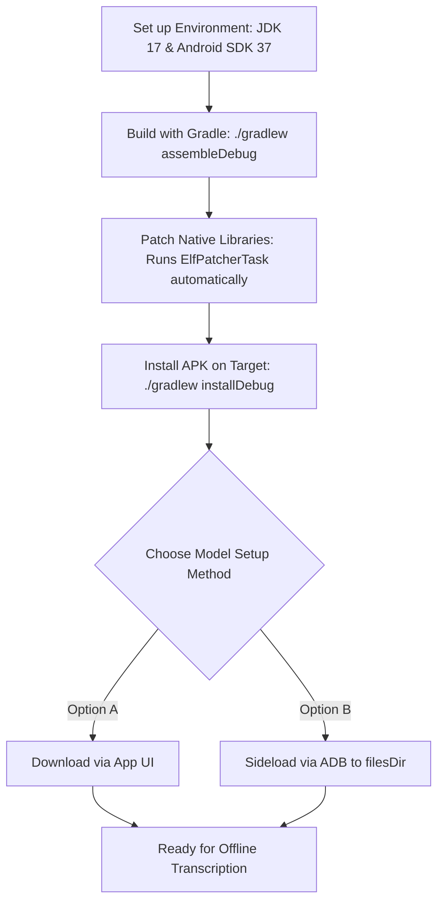
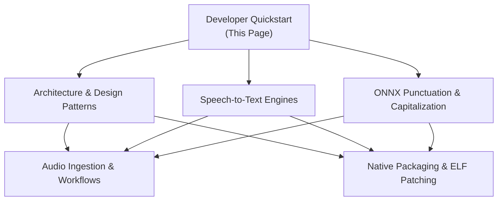

## Introduction

Welcome to the **AintListening** developer quickstart guide! This page is designed to get you from a fresh clone of the repository to a running, fully functional development build on your device or emulator. 

AintListening is an offline-first, private speech-to-text application for Android that processes shared audio files locally. To achieve this secure, on-device execution, the app brings together complex machine learning runtimes (such as **Vosk**, **Whisper**, and **ONNX Runtime**) and integrates them directly inside a modern Android architecture.

---

## 1. Development Environment & Prerequisites

Before building AintListening, ensure your local development workstation meets the following prerequisites:

### Java Development Kit (JDK)
* **Requirement**: **JDK 17**
* **Verification**: Run `java -version` in your terminal to ensure it outputs a `17.x` version. In Android Studio, ensure that your Gradle JDK is configured to use JDK 17 (under **Settings/Preferences > Build, Execution, Deployment > Build Tools > Gradle > Gradle JDK**).

### Android SDK & Build Tools
* **Compile SDK Version**: `37` (Android 15 / UpsideDownCake / VanillaIceCream / Baklava)
* **Target SDK Version**: `37`
* **Minimum SDK Version**: `29` (Android 10)

### Target Platform ABI (Application Binary Interface)
Because AintListening runs heavyweight deep learning models locally, older 32-bit CPU architectures (such as `armeabi-v7a` and `x86`) are not supported. The build system is configured to package native `.so` files exclusively for modern 64-bit architectures:
* **`arm64-v8a`**: Required for deployment to physical Android phones, tablets, or modern ARM-based development hardware.
* **`x86_64`**: Supported for hardware-accelerated development and testing on standard Intel/AMD-based Android Virtual Devices (AVD) or emulators.

---

## 2. Developer Onboarding Pipeline

The following flowchart outlines the step-by-step developer setup and deployment process:


*Figure 1: High-level developer onboarding and execution pipeline.*

---

## 3. Local Model Directory Structure (`filesDir`)

To safeguard user privacy, AintListening does not communicate with external transcription APIs. Instead, it expects all AI model binaries, config files, and vocabulary tokenizers to reside inside the application's secure internal storage directory (`context.getFilesDir()`).

During standard execution, the user can download these models via the in-app **Model Management Activity**. However, for developers, downloading hundreds of megabytes repeatedly during development can be slow. You can sideload the models directly into the app's internal files directory.

### Directory Mapping
The app's internal storage path resolves to:
```text
/data/data/de.switchconsulting.aintlistening/files/
```

Within this directory, the following folders and files must be structured exactly as specified below to match the model manager configuration:

| Model Category | Model Folder/File Name | Sideload Source / Description |
| :--- | :--- | :--- |
| **Smart Formatting (ONNX)** | `ONNXModel_multilingual` | **Directory** extracted from `ONNXModel_multilingual.zip`. Contains the token classification ONNX model and configuration files for capitalization and punctuation restoration. Shared across all supported languages. |
| **Vosk Transcription (German)** | `vosk-model-small-de-0.15` | **Directory** extracted from `vosk-model-small-de-0.15.zip`. Kaldi-based lightweight transcription engine. |
| **Vosk Transcription (English)** | `vosk-model-small-en-us-0.15` | **Directory** extracted from `vosk-model-small-en-us-0.15.zip`. |
| **Vosk Transcription (Spanish)** | `vosk-model-small-es-0.42` | **Directory** extracted from `vosk-model-small-es-0.42.zip`. |
| **Vosk Transcription (French)** | `vosk-model-small-fr-0.22` | **Directory** extracted from `vosk-model-small-fr-0.22.zip`. |
| **Vosk Transcription (Italian)** | `vosk-model-small-it-0.22` | **Directory** extracted from `vosk-model-small-it-0.22.zip`. |
| **Whisper Transcription** | `ggml-tiny.bin` | **Single Binary File** (e.g., `ggml-tiny.bin`). Raw transformer weights used by the native C++ Whisper.cpp transcriber. Shared across all supported languages. |

### Diagnostic & Cache Directories
* **Audio Chunks Cache**: The persistence layer creates a temporary directory named `audio_chunks` inside `filesDir` (i.e., `/data/data/de.switchconsulting.aintlistening/files/audio_chunks/`). This is used to store raw sequential audio fragments as temporary WAV files during active transcription to support incremental playback or chunk export.

### Manual Sideloading via ADB (Recommended for Speed)
On a debuggable development build, you can sideload downloaded models directly to the device's internal files directory using Android Debug Bridge (ADB) and the `run-as` tool:

```bash
# Step 1: Push the model files/folders to a public temporary directory on the device
adb push ONNXModel_multilingual /data/local/tmp/
adb push ggml-tiny.bin /data/local/tmp/

# Step 2: Use run-as to copy them into the app's protected internal filesDir
adb shell "run-as de.switchconsulting.aintlistening mkdir -p /data/data/de.switchconsulting.aintlistening/files/"
adb shell "run-as de.switchconsulting.aintlistening cp -r /data/local/tmp/ONNXModel_multilingual /data/data/de.switchconsulting.aintlistening/files/"
adb shell "run-as de.switchconsulting.aintlistening cp /data/local/tmp/ggml-tiny.bin /data/data/de.switchconsulting.aintlistening/files/"

# Step 3: Clean up temporary files from the device
adb shell rm -rf /data/local/tmp/ONNXModel_multilingual
adb shell rm -f /data/local/tmp/ggml-tiny.bin
```

---

## 4. Building the Application via Gradle

AintListening utilizes standard Gradle commands for build and dependency management. Because of the heavy native dependencies, several custom build phases exist.

### Core Build Commands

* **Clean the Build Directory**:
  ```bash
  ./gradlew clean
  ```
  *Cleans the build outputs, including the intermediate patched JNI directories.*

* **Build Debug APK**:
  ```bash
  ./gradlew assembleDebug
  ```
  *Compiles the Java sources, triggers dependency injection generation via Hilt, and packages a debug-signed APK. This command automatically executes the custom ELF patching step before completing.*

* **Install Debug APK**:
  ```bash
  ./gradlew installDebug
  ```
  *Assembles and installs the application directly onto the currently connected Android device or running emulator.*

* **Run Local Unit Tests**:
  ```bash
  ./gradlew testDebugUnitTest
  ```
  *Runs Mockito-backed unit tests for local application components.*

### The Custom `patchDjlNativeLibs` Task

To run Deep Java Library (DJL) and ONNX tokenizers natively on modern 64-bit Android platforms without encountering critical dynamic linker errors (e.g., `java.lang.UnsatisfiedLinkError`), the build system incorporates a custom **`ElfPatcherTask`**:

1. **Auto-Execution**: This task is bound to the standard Gradle compilation lifecycle. Whenever Gradle invokes JNI merging tasks (such as `mergeDebugJniLibFolders`), `patchDjlNativeLibs` is executed automatically.
2. **Manual Invocation**: You can trigger the ELF patching process independently by running:
   ```bash
   ./gradlew patchDjlNativeLibs
   ```
3. **What it does**: It scans dependency paths, extracts native `.so` files (for `arm64-v8a`), and rewrites their ELF header properties (adjusting `DT_NEEDED` and removing illegal `RUNPATH` entries) before placing them inside the intermediate generated path:
   ```text
   build/generated/patchedJniLibs/arm64-v8a/
   ```
   This ensures perfect runtime compatibility when loaded on device.

---

## 5. Task-Oriented Navigation Map

Now that your local environment is configured and the app is building successfully, use the following routing guide to navigate the rest of the system documentation based on your development objectives:


*Figure 2: Conceptual documentation navigation paths.*

### Core Documentation Directory & Subpages

To help you find detailed technical insights quickly, below are direct links to every subpage within the Wiki:

#### Detailed Technical Guides
* **[Developer Quickstart](/openwiki/quickstart.md)** (This Page): Prerequisite environment setup, build workflows, and local model directory structure.
* **[System Architecture Overview](/openwiki/architecture/overview.md)**: Details the overall app structure, dependency injection rules with Dagger Hilt, and the MVVM presentation layer layout.
* **[Local Transcription Engines](/openwiki/concepts/transcription-engines.md)**: Compares the Vosk and Whisper native engines, explaining their integration, lifecycle states, and sample rate standards.
* **[ONNX-Based Smart Formatting](/openwiki/concepts/smart-formatting.md)**: Explains the HuggingFace tokenizers, deep learning post-processing models, and runtime formatting execution loops.
* **[Audio Ingestion & Processing Workflow](/openwiki/workflows/ingestion-and-processing.md)**: Details the end-to-end data processing workflow from a shared audio file intent to local audio resampling (16kHz mono), background processing, and database storage.
* **[Gradle Build and ELF Patching Operations](/openwiki/operations/build-and-elfpatching.md)**: Deep-dive reference guide covering Gradle configuration, NDK compilation, legacy JNI packaging, and the `ElfPatcherTask` internals.

#### Wiki Index & Directory Hubs
* **[Wiki Main Index](/openwiki/index.md)**: The home portal listing all top-level documentation files and categories.
* **[Architecture Index](/openwiki/architecture/index.md)**: Folder index for design patterns, Hilt setup, and MVVM diagrams.
* **[Concepts Index](/openwiki/concepts/index.md)**: Folder index for on-device AI runtimes and post-processing.
* **[Operations Index](/openwiki/operations/index.md)**: Folder index for build orchestration, ELF patching, and ProGuard rules.
* **[Workflows Index](/openwiki/workflows/index.md)**: Folder index for audio ingestion, decoding, and data persistence workflows.
