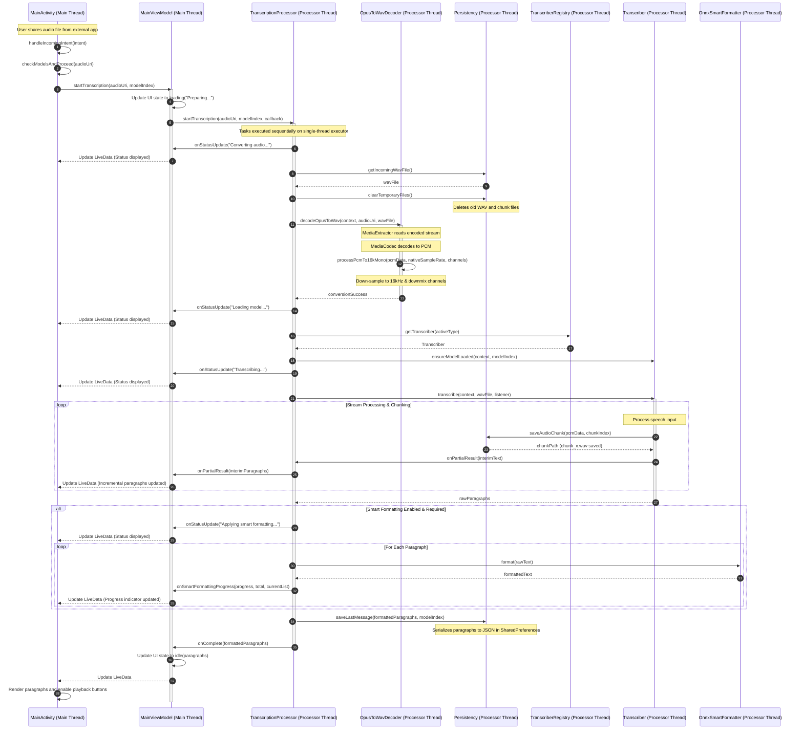

# Audio Ingestion & Processing Workflow

## Introduction

AintListening features a completely offline, secure, and privacy-respecting pipeline to ingest, decode, transcribe, format, and persist audio recordings. This end-to-end workflow processes incoming voice notes or audio files shared from other applications (e.g., WhatsApp, Signal, or voice recorder apps) via Android's native share mechanisms, transforms them into a uniform audio format, transcribes them natively using deep learning, post-processes the results to insert punctuation/capitalization, and saves the final output to persistent storage—all without sending a single byte of data to external servers.

---

## 1. Share Ingestion & Intent Resolution

The workflow begins when the user shares an audio file from an external application. `MainActivity` serves as the entry point, filtering incoming `Intent` objects to catch shared media.

* **Intent Interception**: `MainActivity` overrides the activity lifecycle hooks (`onCreate` and `onNewIntent`) to intercept intents with the action `Intent.ACTION_SEND` and a MIME type starting with `audio/` (e.g., `audio/ogg`, `audio/aac`, `audio/wav`).
* **URI Extraction**: It retrieves the audio stream URI from the intent's `EXTRA_STREAM` parcelable.
* **Model Selection and Guarding**: Before triggering transcription, `MainActivity` queries `ModelManager` to verify which language models are currently downloaded and enabled by the user.
  - If no models are available, it warns the user and aborts.
  - If exactly one model is available, it automatically triggers transcription.
  - If multiple models are available, it displays a `MaterialAlertDialogBuilder` prompting the user to select their desired language.
* **ViewModel Delegation**: Once the language is determined, the activity delegates the URI and the selected model index to `MainViewModel`.

---

## 2. The Decoding Pipeline (`OpusToWavDecoder`)

Since the shared audio file may be encoded in various compression formats (most notably Opus/OGG utilized by modern messengers), and local transcription engines like Vosk require raw, uncompressed audio with a uniform structure, AintListening passes the audio URI through a custom `OpusToWavDecoder`. 

This decoder uses Android's native multimedia API (`MediaExtractor` and `MediaCodec`) to decode the source file and resample it into a standard **16kHz, Mono, 16-bit PCM WAV** file.

### Step-by-Step Decoder Execution

1. **Audio Track Selection**: The decoder instantiates a `MediaExtractor` and binds it to the shared audio URI. It loops through the file's tracks to find the first track with a MIME type starting with `audio/`.
2. **Decoder Initialization**: It retrieves the `MediaFormat` for the audio track, extracts the track MIME type, and instantiates the appropriate hardware or software audio decoder via `MediaCodec.createDecoderByType(mime)`. It configures and starts the decoder.
3. **WAV File Setup & Header Initialization**: The decoder opens a `FileOutputStream` pointing to the target temporary WAV file and writes a placeholder 44-byte RIFF-WAV header containing zeroed-out lengths.
4. **The Decoding Loop**:
   - **Input Buffer Queueing**: The decoder dequeues available input buffers from `MediaCodec`. It reads raw encoded audio chunks from `MediaExtractor` and queues them into the decoder's input buffers using `queueInputBuffer`. If the end of the extractor stream is reached, the `BUFFER_FLAG_END_OF_STREAM` is set.
   - **Output Buffer Dequeueing**: It dequeues output buffers containing decoded, raw PCM bytes. For each output buffer, it reads the raw bytes and processes them through the resampling engine.
5. **Resampling & Downmixing (`processPcmTo16kMono`)**:
   - The raw byte buffer is parsed into a `short` array (little-endian, 16-bit PCM).
   - **Down-Sampling**: The decoder calculates the down-sampling step based on the ratio of the native sample rate to the target sample rate (16000Hz):
     $$\text{step} = \frac{\text{nativeSampleRate}}{\text{TARGET\_SAMPLE\_RATE}}$$
   - **Channel Downmixing**: If the input has multiple channels (e.g., stereo), the decoder averages the sample amplitudes across all channels to downmix the audio into a single mono channel:
     $$\text{sample}_{\text{mono}} = \frac{1}{\text{channels}} \sum_{c=0}^{\text{channels}-1} \text{sample}_{i+c}$$
   - **Re-serialization**: The resampled and downmixed `short` array is packed back into little-endian bytes and written directly to the output stream.
6. **WAV Header Update**: Once the input and output streams are completely processed (EOS), the decoder closes the output stream. It opens the WAV file using a `RandomAccessFile` and overwrites the initial 44-byte header with the actual PCM length and calculated subchunk sizes.

---

## 3. The Orchestration & Multi-Threading Model

To keep the application highly responsive, fluid, and free of Application Not Responding (ANR) errors, AintListening enforces a strict multi-threading model using structured thread boundaries and single-thread background executors.

```
┌─────────────────────────────────────────────────────────────────┐
│                       MAIN UI THREAD                            │
│  - MainActivity handles incoming Intent and UI events.         │
│  - Observes LiveData updates from MainViewModel.                │
│  - Updates progress indicator and transcription RecyclerView.   │
└────────────────────────────────┬────────────────────────────────┘
                                 │
                                 ▼ (Dispatches Task)
┌─────────────────────────────────────────────────────────────────┐
│                       MAIN VIEWMODEL                            │
│  - Relays transcription requests to TranscriptionProcessor.     │
│  - Observes and translates background callbacks into LiveData.  │
└────────────────────────────────┬────────────────────────────────┘
                                 │
                                 ▼ (Offloads to Executor)
┌─────────────────────────────────────────────────────────────────┐
│                 TRANSCRIPTION PROCESSOR EXECUTOR                │
│             (Single-Thread Background Executor)                 │
│  - Clear temporary cache and segment files sequentially.        │
│  - Invokes OpusToWavDecoder to convert audio files.             │
│  - Decodes and stream-transcribes WAV (Vosk / Whisper).         │
│  - Performs ONNX Smart Formatting sequentially.                 │
│  - Persists completed paragraphs to SharedPreferences.           │
└─────────────────────────────────────────────────────────────────┘
```
*Figure 1: High-level architectural threading and dispatching model.*

### Thread Responsibilities and Boundaries

* **Main UI Thread**: Responsible for handling user interactions, presenting dialogs, rendering the `RecyclerView`, and animating the progress indicators. All UI-related changes are driven by observing `uiState` (a LiveData stream) inside the `MainActivity`.
* **ViewModel Dispatching**: `MainViewModel` acts as the bridge. It initiates the transcription process by calling `TranscriptionProcessor.startTranscription` and registers a `TranscriptionCallback` to capture status messages, partial results, formatting progress, and final outputs. Inside the callback methods, it calls `postValue()` on the `MutableLiveData` to safely post UI state changes from background threads to the main UI thread.
* **`TranscriptionProcessor` Single-Thread Executor**: Instantiated as `Executors.newSingleThreadExecutor()`, this executor processes all transcription tasks sequentially. This is a critical design choice because loading deep-learning models (Vosk/Whisper/ONNX) and running inference is highly CPU and memory intensive. Processing them on a single dedicated background thread avoids thread contention, prevents memory exhaustion, and guarantees thread safety during model loading and file I/O.
* **`ModelDownloader` Background Executor**: A separate static single-thread background executor is used inside `ModelDownloader` to handle HTTP download connections and extract model zip files. Keeping model downloading on a distinct thread ensures that a downloading task does not block or queue up behind a concurrent transcription task, allowing users to manage models while transcribing.

---

## 4. Temporary File Clearing, Audio Chunk Splitting, and Persistence

AintListening utilizes local file boundaries and segmented cache files to enable paragraph-level playback and ensure efficient storage utilization.

### Temporary File Cleansing

Before any new audio file is processed, `TranscriptionProcessor` ensures a pristine environment by invoking `persistency.clearTemporaryFiles()`. This operation:
1. Deletes the primary decoded audio WAV file (`incoming_audio_16k_mono.wav`) located in the cache directory.
2. Deletes all previously split audio chunk files (`chunk_*.wav`) stored in the `audio_chunks/` internal directory.

This prevents stale files from polluting device storage and ensures that paragraph playback buttons always refer to the current transcription's audio segments.

### Audio Chunk Splitting

Both local transcription engines segment the incoming audio file and map each transcription paragraph to its exact corresponding raw audio chunk. However, they achieve this through different technical mechanisms:

#### A. Vosk-Based Chunk Splitting (On-The-Fly)
Because the `VoskTranscriber` does not natively output word-level or sentence-level timestamps, it splits audio dynamically during the recognition loop:
* The WAV file is read sequentially in 4096-byte buffers, which are fed into Vosk's `Recognizer`.
* The raw PCM bytes are continuously written to an active `ByteArrayOutputStream`.
* When `recognizer.acceptWaveForm(buffer, nread)` returns `true` (signaling that a natural silence or segment boundary has been finalized), the transcriber triggers `listener.onAudioChunkAvailable(pcmData, chunkIndex++)`.
* This flushes the accumulated bytes in the stream to a new WAV chunk file (`chunk_{index}.wav`) via `persistency.saveAudioChunk()`, returns its file path, and resets the stream.
* The transcriber then maps the newly finalized `TranscriptionParagraph` to this specific audio chunk path.

#### B. Whisper-Based Chunk Splitting (Timestamp-Based Extraction)
Since `WhisperTranscriber` processes the entire audio stream and returns precise segment-level timing markers (`[startMs --> endMs]`), it segments the audio retrospectively:
* It analyzes consecutive segments to detect silence pauses between sentences. If a pause exceeds `SILENCE_GAP_MS` (100ms) and the sentence has ended, or if the paragraph exceeds 400 characters, a split boundary is triggered.
* To extract the corresponding audio chunk, it opens the source WAV file using a `RandomAccessFile` and seeks directly to the target byte offsets.
* Since the WAV file is structured as 16kHz, 16-bit mono, each millisecond of audio consumes exactly **32 bytes**:
  $$\text{bytes/ms} = 16 \text{ samples/ms} \times 2 \text{ bytes/sample} = 32 \text{ bytes/ms}$$
* The exact byte range is computed as:
  $$\text{startByte} = 44 + (\text{startMs} \times 32)$$
  $$\text{endByte} = 44 + (\text{endMs} \times 32)$$
* The transcriber reads this precise byte range, packages it as a WAV chunk via `listener.onAudioChunkAvailable()`, and maps it to the paragraph.

### Persistency Mechanism for Saving Paragraphs

Once transcription and any applicable smart formatting are completed, `TranscriptionProcessor` saves the final list of paragraphs to the device's private `SharedPreferences` to support state persistence across app launches:
* **Serialization**: The orchestrator converts the list of `TranscriptionParagraph` items into a serialized JSON array. Each JSON object records:
  - `raw`: The unformatted transcribed text.
  - `formatted`: The post-processed text (if smart formatting was applied).
  - `showFormatted`: A boolean indicating whether the UI should show the formatted or raw text.
  - `audioPath`: The absolute file path of the saved paragraph-level audio chunk.
* **Saving**: This JSON string and the index of the language model used are stored in `SharedPreferences` under the keys `last_paragraphs_json` and `last_model_index`.
* **State Recovery**: Upon launching the app or resuming, `MainActivity` queries the ViewModel, which loads this JSON string and reconstructs the `TranscriptionParagraph` objects, instantly populating the `RecyclerView` without re-running any CPU-intensive transcription.

---

## 5. End-To-End Runtime Ingestion Sequence

The following sequence diagram traces the complete runtime flow of an incoming share intent, showing the thread hops and execution steps from ingestion to final persistence:


_Figure 2: Sequence diagram detailing the ingestion and processing flow starting from an incoming Intent._
