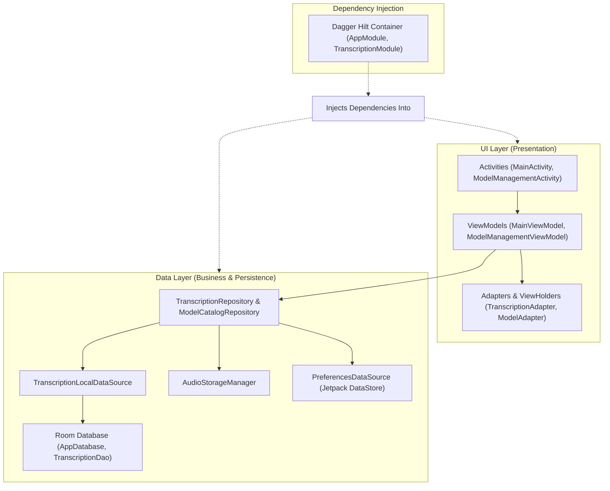
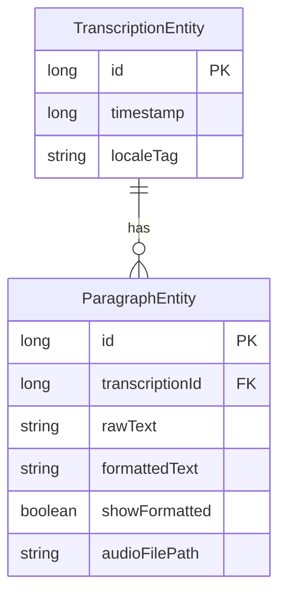

The A'int Listening application is a privacy-focused offline transcription tool for Android. It processes shared audio messages locally using on-device models (such as Vosk and Whisper) without transmitting audio data to external servers.

This document describes the high-level architecture of the application, including its primary layers, dependency injection patterns, local persistence boundaries, and data models.

## High-Level Layer Architecture

The codebase follows a clean, three-layered architecture designed to separate concerns, ensure testability, and decouple the UI from on-device machine learning models.


*High-level representation of the clean three-layered architecture of the application.*

### 1. UI Layer (Presentation)
The UI layer is built using Jetpack components and standard Material Design structures, coordinating via unidirectional state streams:
*   **Activities (`MainActivity`, `ModelManagementActivity`)**: Served as standard entrypoints. Annotated with `@AndroidEntryPoint` to initiate Hilt's member injection. `MainActivity` intercepts incoming audio sharing Intents (e.g., audio file shares), sets up the user interface, and binds observers to the view models.
*   **ViewModels (`MainViewModel`, `ModelManagementViewModel`)**: Handled via `@HiltViewModel`. ViewModels retain states across configuration changes (such as device rotation), expose reactive UI states using `LiveData`, and delegate long-running asynchronous transcription and downloading flows to underlying repositories.
*   **Adapters & ViewHolders (`TranscriptionAdapter` / `TranscriptionViewHolder`, `ModelAdapter` / `ModelViewHolder`)**: Decouple the display logic. The `TranscriptionAdapter` dynamically adjusts cell representation to display raw transcription text, smart formatted paragraphs, playback control buttons, and copy actions based on user preferences.

### 2. Data Layer (Business Logic & Persistence)
The Data layer coordinates all offline processing, model files, preference updates, and database actions:
*   **Repositories (`TranscriptionRepository`, `ModelCatalogRepository`)**: Singletons acting as the primary facades for ViewModels. They coordinate domain-specific business logic. For example, `TranscriptionRepository` unifies audio saving, paragraph local persistence, and user configuration queries.
*   **Local Data Sources & Managers (`TranscriptionLocalDataSource`, `AudioStorageManager`)**: Encapsulate concrete platform mechanics. `TranscriptionLocalDataSource` interfaces with the Room DAO, wrapping operations with thread safety via synchronized blocks. `AudioStorageManager` handles disk space, directories, and WAV file chunk exports.

### 3. Dependency Injection Layer
*   **Dagger Hilt**: Serves as the dependency injection framework, defining the lifetime and scope of every component across the application lifecycle.

---

## Dependency Injection & Extensible Engine Multibindings

The application uses **Dagger Hilt** as its Dependency Injection (DI) container. Rather than manually wiring instances, Hilt handles the compilation, lifetime resolution, and safe injection of all repositories, data sources, and system context parameters.

### Module Definitions
1.  **`AppModule`**: Contains providers for core system-level dependencies. It provides singletons such as the Room `AppDatabase`, `TranscriptionDao`, `PreferencesDataSource`, and `AudioStorageManager`. It installs in the Hilt `SingletonComponent.class`.
2.  **`TranscriptionModule`**: A specialized abstract module that uses Hilt **Multibindings** to dynamically register transcription engines.

### Extensible Multibindings Pattern
To avoid tight coupling between the transcription processor and individual engine implementations (like Vosk and Whisper), the system relies on Dagger's `@IntoSet` multibindings. This permits adding or removing on-device speech-to-text engines without editing the core pipeline or the registry.

<!-- openwiki: mermaid parse failed and this diagram was converted to a text fence so it does not break rendering. Fix the diagram source and restore the mermaid fence. Parser error: Parse error on line 27: ... "Set~Transcriber~" : Injected In Constr... Expecting 'ALPHA', 'NUM', 'MINUS', 'UNICODE_TEXT', 'BQUOTE_STR', got 'LABEL' -->
```text
classDiagram
    direction LR
    class Transcriber {
        <<interface>>
        +getType() TranscriberType
        +transcribe(File, TranscriptionListener)
        +close()
    }
    class VoskTranscriber {
        +getType() VOSK
    }
    class WhisperTranscriber {
        +getType() WHISPER
    }
    class TranscriptionModule {
        +bindVoskTranscriber() Transcriber
        +bindWhisperTranscriber() Transcriber
    }
    class TranscriberRegistry {
        -Map~TranscriberType, Transcriber~ transcribers
        +getTranscriber(type) Transcriber
    }

    Transcriber <|.. VoskTranscriber
    Transcriber <|.. WhisperTranscriber
    TranscriptionModule ..> Transcriber : "@Binds @IntoSet"
    TranscriberRegistry --> "Set~Transcriber~" : Injected In Constructor
```
*Design of the extensible multibinding transcriber registry.*

1.  **Engine Registration (`TranscriptionModule`)**:
    Individual transcribers are bound into a common set using `@Binds` and `@IntoSet` annotations:
    ```java
    @Binds
    @IntoSet
    @Singleton
    public abstract Transcriber bindVoskTranscriber(VoskTranscriber impl);

    @Binds
    @IntoSet
    @Singleton
    public abstract Transcriber bindWhisperTranscriber(WhisperTranscriber impl);
    ```
2.  **Registry Compilation (`TranscriberRegistry`)**:
    The `TranscriberRegistry` declares a dependency on `Set<Transcriber>`. Hilt automatically injects all registered engines:
    ```java
    @Inject
    public TranscriberRegistry(Set<Transcriber> transcriberSet) {
        for (Transcriber transcriber : transcriberSet) {
            if (transcriber.getType() != null) {
                transcribers.put(transcriber.getType(), transcriber);
            }
        }
    }
    ```
    This registry resolves active models at runtime and offers a central entry point (`closeAll()`) to clean up ML engine allocations.

---

## Local Persistence Boundaries

To respect user privacy, the application stores all data locally. This local storage is organized into three distinct persistence boundaries:

```
┌────────────────────────────────────────────────────────────────────────┐
│                        Local Storage Boundaries                        │
├──────────────────────────┬────────────────────────┬────────────────────┤
│   Key-Value Preferences  │  Structured History    │   Media File Disk  │
│  (Jetpack DataStore)     │    (Room Database)     │    (Device Cache)  │
├──────────────────────────┼────────────────────────┼────────────────────┤
│ • Button Visibilities    │ • Transcription Session│ • Incoming Cache:  │
│ • Selected Engines       │ • Segmented Paragraphs │   /cacheDir/       │
│ • Locale Formatter State │ • FK Casaded Deletes   │ • Audio Chunks:    │
│                          │                        │   /filesDir/       │
└──────────────────────────┴────────────────────────┴────────────────────┘
```

### 1. Key-Value Storage (Jetpack Preferences DataStore)
Rather than using Android's legacy, blocking, and non-type-safe `SharedPreferences`, the system utilizes the modern **Jetpack Preferences DataStore** mapped via RxJava3 (`RxDataStore<Preferences>`).
*   **Responsibilities**: Manages persistent UI configurations, locale preferences, active engines, and formatting states.
*   **Key Settings**:
    *   *UI Display toggles*: `show_playback_button`, `show_copy_button`, `show_raw_text`, and `show_smart_text`.
    *   *Language selections*: Engine types associated per locale (e.g., `transcriber_type_en`, `transcriber_type_de`) and active states (`lang_enabled_<tag>`).

### 2. Structured Persistence (Room Database)
For relational, structured history, the application runs a local **Room SQLite Database** (`AppDatabase`).
*   **Responsibilities**: Tracks historical transcription sessions and paragraphs.
*   **Components**: Exposes operations through `TranscriptionDao`, allowing thread-safe loads and insertions. Thread safety is maintained by the repository source via object-level locks (`dbLock`) during writing/reading blocks.

### 3. Media Storage (Disk Cache vs. Files Directories)
Sound recordings are stored on disk with strict lifecycle separation:
*   **Temporary Cache (`context.getCacheDir()`)**:
    *   *File Name*: `incoming_audio_16k_mono.wav`.
    *   *Role*: Shared incoming audio is extracted, converted, and decoded here temporarily for the duration of the transcription pipeline run.
    *   *Cleanup*: Instantly deleted when clearing temporary files or during the execution of subsequent conversions.
*   **Persistent Audio Chunks (`context.getFilesDir()`)**:
    *   *Directory Path*: `context.getFilesDir()/audio_chunks/`.
    *   *Role*: To support per-paragraph voice playback within the transcript adapter history, individual processed voice chunks are stored as separate WAV segments (`chunk_<index>.wav`).
    *   *Cleanup*: Cleared explicitly when the user resets transcription history.

---

## Entity-Relationship Data Model

The database contains two core tables: `transcriptions` (represented by `TranscriptionEntity`) and `paragraphs` (represented by `ParagraphEntity`).


*Entity-Relationship diagram of the local persistent database showing the relationships and constraints.*

### Cascade Delete Constraints
The association from `TranscriptionEntity` (one parent session) to `ParagraphEntity` (many text blocks) is governed by an explicit **foreign key cascade delete rule**:

```java
@Entity(
        tableName = "paragraphs",
        foreignKeys = @ForeignKey(
                entity = TranscriptionEntity.class,
                parentColumns = "id",
                childColumns = "transcriptionId",
                onDelete = ForeignKey.CASCADE
        ),
        indices = {@Index("transcriptionId")}
)
```

*   **Mechanism**: The child table is indexed on `transcriptionId` to optimize lookup queries.
*   **Cascade Rule**: When a `TranscriptionEntity` record is removed from the parent table, SQLite/Room automatically purges all corresponding `ParagraphEntity` rows whose `transcriptionId` matches the deleted parent ID. This prevents orphan database records and ensures transactional integrity.

---

## Architectural Verification and Testing

This architecture is verified through dedicated unit tests ensuring that each component maintains its boundaries and invariants:

*   **`TranscriberRegistryTest`**: Validates the multibinding resolution. Asserts that the injected `Set<Transcriber>` maps correctly to their respective `TranscriberType` keys inside `TranscriberRegistry`, and verifies that invoking `closeAll()` correctly delegates resource-release commands to all underlying engines.
*   **`PreferencesDataSourceTest`**: Asserts that default state boundaries are respected across Preference DataStore updates and verifies setting-by-setting modifications.
*   **`TranscriptionLocalDataSourceTest`**: Exercises database mapping, verifying correct conversions between entity collections and the `TranscriptionParagraph` logical models.
*   **`TranscriptionRepositoryTest`**: Ensures coordination logic behaves properly, verifying file creation redirections, database delegates, and temporary directories cleanup.

## Related Documents
*   [Model Management](../concepts/model-management.md) — For deep dives on model downloading, extraction, and file management on-device.
*   [Quickstart](../quickstart.md) — To get the app configured and running.
*   [Transcription Pipeline](../workflows/transcription-pipeline.md) — Explains the control flow and decoding operations behind speech processing.
