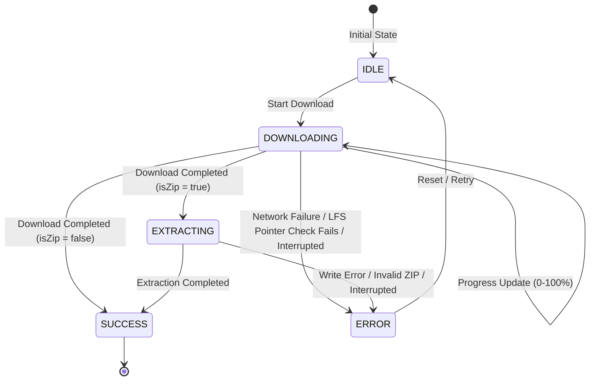

# Model Management & Lifecycle

In a privacy-first, fully offline speech recognition application, managing speech and formatting models locally on the device is of paramount importance. **AintListening** avoids cloud dependencies by utilizing local on-device machine learning engines. Consequently, models must be defined, acquired, verified, and updated securely.

This document details the architectural components, lifecycles, and download/extraction mechanisms that govern speech and formatting models in AintListening.

---

## Architectural Overview & Engines

AintListening supports two distinct speech recognition engines and one auxiliary smart formatting engine:

1. **Vosk Speech Engine**: A lightweight, fast, offline speech-to-text transcriber. It relies on language-specific models (e.g., `vosk-model-small-de-0.15` at ~45MB) packed as ZIP files which must be extracted on the device.
2. **Whisper Speech Engine (ggml)**: OpenAI's Whisper engine running locally via Whisper.cpp. It uses a single model binary (`ggml-tiny.bin` at ~75MB) which is downloaded directly without zip extraction.
3. **Smart Formatting (Punctuation) Engine**: A multilingual ONNX-based punctuation model (`ONNXModel_multilingual` at ~280MB) packaged as a ZIP file. It is shared across multiple languages (German, English, Spanish, French, and Italian) to capitalize transcripts and insert appropriate punctuation.

These engines are integrated into the larger processing pipeline. To learn how models are utilized during an active transcription job, see the [Transcription Pipeline](../workflows/transcription-pipeline.md).

---

## Model Catalog Architecture

The models supported by the application are declared statically in the system metadata. Rather than retrieving model configurations from a remote API, the catalog definitions are bundled into the application to ensure deterministic behavior without internet connectivity.

### The Metadata Structures

Model configurations are structured using three primary classes:

*   **`ModelInfo`**: A Java record that acts as the data container for a single model's metadata.
    *   `name`: The internal directory name or file name (e.g., `vosk-model-small-de-0.15` or `ggml-tiny.bin`).
    *   `url`: The direct HTTPS URL where the asset is hosted.
    *   `locale`: The targeted language `Locale`.
    *   `size`: Human-readable size string (e.g., `"45MB"`).
    *   `type`: The `TranscriberType` (e.g., `VOSK`, `WHISPER`).
    *   `isZip`: A boolean flag indicating whether the downloaded asset is a ZIP archive that requires extraction (`true` for Vosk and ONNX formatting models, `false` for Whisper).
*   **`LanguageSupport`**: A container class representing a language and its associated models. It groups together a target `Locale` (acting as the primary key), a map of transcription models keyed by their `TranscriberType`, and an optional `ModelInfo` representing the smart formatting punctuation model.
*   **`ModelCatalog`**: A static repository class that contains the master list of all supported languages (`SUPPORTED_LANGUAGES`). It defines the resource mapping for engine names and serves as the source of truth for all statically declared models, including the shared multilingual ONNX punctuation model.

### Static Declarations Example

As defined in `ModelCatalog`, the shared punctuation model and Whisper models are defined globally, and then associated with specific languages:

```java
private static final String SHARED_PUNC_MODEL_NAME = "ONNXModel_multilingual";
private static final String SHARED_PUNC_MODEL_URL = "https://github.com/switch-consulting/AintListening/raw/main/models/ONNXModel_multilingual.zip";
private static final String SHARED_PUNC_MODEL_SIZE = "280MB";

private static final String WHISPER_TINY_NAME = "ggml-tiny.bin";
private static final String WHISPER_TINY_URL = "https://huggingface.co/ggerganov/whisper.cpp/resolve/main/ggml-tiny.bin";
private static final String WHISPER_TINY_SIZE = "75MB";
```

These definitions are packaged into language support objects statically within `ModelCatalog`'s static initializer block, ensuring compiled-in safety for all model properties.

---

## Model Download & Extraction Lifecycle

The download and extraction process is stateful, reporting progress and phase transitions back to the UI.

### State Transitions

A model download operation transitions through several distinct states represented by `DownloadStatus` and encapsulated in `DownloadState`:

1.  **`IDLE` (Pending)**: The initial state. No active download is running.
2.  **`DOWNLOADING`**: The model file is actively being transferred. The state carries a progress percentage (0-100%).
3.  **`EXTRACTING`**: The file has been fully downloaded and, if it is a ZIP, is currently being unzipped on a background thread.
4.  **`SUCCESS`**: The model has been downloaded, extracted (if needed), verified, and is ready for use.
5.  **`ERROR`**: An exception was encountered. The state retains the exception object for debugging.

The state transitions are depicted in the state diagram below:


*Model Download and Extraction Lifecycle State Machine.*

---

## The Model Downloader Component

The `ModelDownloader` is a thread-safe `@Singleton` service responsible for executing download tasks, performing redirects, extracting archives, and ensuring data integrity.

### Thread Safety and Execution

`ModelDownloader` separates background processing from main thread UI interactions by utilizing Dagger-injected executors:
*   **`@BackgroundExecutor ExecutorService`**: An asynchronous executor used to download files and extract them without blocking the Android UI thread.
*   **`@MainExecutor Executor`**: Used to post callbacks (`onProgress`, `onExtracting`, `onSuccess`, `onError`, `onCancelled`) back to the main thread.

The public entrypoints `downloadAndExtract()` and `cancel()` are `synchronized`. When `downloadAndExtract()` is called, any current active download task is cancelled first, the `isCancelled` flag is reset, and a new future is submitted to the background executor.

### Resilient HTTP Redirect Handling

Since models are often hosted on external repositories, CDNs, or file shares (such as GitHub or HuggingFace) that perform redirection, the `ModelDownloader` manually handles HTTP redirects.

It follows up to five consecutive redirect hops using `HttpURLConnection`. If it encounters status codes `301`, `302`, `303`, `307`, or `308`, it extracts the `Location` header, disconnects the current socket, and opens a new connection to the redirected URL.

### Git LFS Pointer Verification

A common issue when hosting large files on GitHub or other Git repositories is that downloading a file via an unconfigured environment returns a small text file (a Git LFS pointer) instead of the actual model binary.

To prevent this silent corruption from breaking the speech engines, `ModelDownloader` implements a safety check immediately after download completes:
```java
if (targetFile.length() < 500) {
    try (Scanner scanner = new Scanner(targetFile)) {
        if (scanner.hasNextLine() && scanner.nextLine().startsWith("version https://git-lfs")) {
            throw new Exception("Downloaded file is a Git LFS pointer. Check LFS quota or URL.");
        }
    }
}
```
If the downloaded file is under 500 bytes and matches the Git LFS pointer format, the downloader throws an exception, halts extraction, and triggers the `onError` callback.

### Extraction & Temp File Lifecycle

To prevent partially downloaded or corrupted zip files from polluting the internal storage, files are downloaded under a temporary name:
*   **Zipped models** are downloaded as `model_temp.zip` in the target directory. Once downloaded, `ModelDownloader` unzips its contents using `ZipInputStream` and then deletes the temporary zip file.
*   **Raw model binaries** (such as Whisper models) are downloaded directly under their real name (e.g., `ggml-tiny.bin`).

### Error Recovery & Cancellation

If the download is cancelled by the user (or if the `ModelManagementViewModel` is cleared), the volatile `isCancelled` flag is set to `true`, and the background thread future is cancelled with an interrupt.
*   Upon cancellation or error, any partially downloaded temporary file is proactively deleted from storage to free up disk space and avoid corrupted models.

---

## Local Storage & Manual Side-Loading

AintListening supports automated updates through the **Model Management UI** and manual side-loading.

### Storage Paths on Android

All models are stored within the application's secure internal sandbox directory:
`/data/data/de.switchconsulting.aintlistening/files/`

The `ModelCatalogRepository` evaluates if a model is present by looking for files relative to this directory:
*   **Zipped Models** (Vosk and Punctuation): Verified using `isZip()`. The repository checks if a directory matching `ModelInfo.name()` exists and is indeed a directory:
    `/data/data/de.switchconsulting.aintlistening/files/{model_name}/`
*   **Raw Model Binaries** (Whisper): Verified by checking if a file matching `ModelInfo.name()` exists and is a file:
    `/data/data/de.switchconsulting.aintlistening/files/ggml-tiny.bin`

### Manual Side-Loading Instructions

Users or developers who want to avoid downloading large files over the air can manually side-load models into the application:

1.  **Download the Model Archive/Binary**:
    *   For **Vosk German**: Download [vosk-model-small-de-0.15.zip](https://alphacephei.com/vosk/models/vosk-model-small-de-0.15.zip)
    *   For **Vosk English**: Download [vosk-model-small-en-us-0.15.zip](https://alphacephei.com/vosk/models/vosk-model-small-en-us-0.15.zip)
    *   For **ONNX Smart Formatting**: Download [ONNXModel_multilingual.zip](https://github.com/switch-consulting/AintListening/raw/main/models/ONNXModel_multilingual.zip)
    *   For **Whisper Tiny**: Download [ggml-tiny.bin](https://huggingface.co/ggerganov/whisper.cpp/resolve/main/ggml-tiny.bin)

2.  **Prepare files**:
    *   Extract ZIP files on your local computer. The root folder within the extracted zip should have the exact name declared in `ModelInfo.name()` (e.g., `vosk-model-small-de-0.15` containing `am/`, `graph/`, etc., or `ONNXModel_multilingual` containing `.onnx` and configuration files).
    *   Do not extract Whisper binary files (`ggml-tiny.bin`). Keep them as-is.

3.  **Transfer files to the device**:
    Using `adb` or a root file explorer, copy the files to the app's internal sandbox:
    ```bash
    # For Vosk German
    adb push ./vosk-model-small-de-0.15 /data/data/de.switchconsulting.aintlistening/files/vosk-model-small-de-0.15
    
    # For ONNX Formatting Model
    adb push ./ONNXModel_multilingual /data/data/de.switchconsulting.aintlistening/files/ONNXModel_multilingual

    # For Whisper Model
    adb push ./ggml-tiny.bin /data/data/de.switchconsulting.aintlistening/files/ggml-tiny.bin
    ```

4.  **Restart the Application**:
    Upon restarting, `ModelCatalogRepository` automatically scans `/data/data/de.switchconsulting.aintlistening/files/` and detects the side-loaded models. The UI will display them as installed, bypassing the download option.

---

## Coordination and UI Integration

The `ModelCatalogRepository` and `ModelManagementViewModel` coordinate the interface with model downloading.

```
+----------------------------+
|   ModelManagementView      |
+-------------+--------------+
              |
              v (Observe LiveData<DownloadState>)
+-------------+--------------+
| ModelManagementViewModel   |
+-------------+--------------+
              |
              v (downloadAndExtract / cancel)
+-------------+--------------+
|      ModelDownloader       |
+-------------+--------------+
              |
              +---> Updates local disk files under context.getFilesDir()
              |
+-------------+--------------+
|   ModelCatalogRepository   | <--- Scans disk directory to verify status
+----------------------------+
```

*   **`ModelCatalogRepository`**: Checks installation status, manages user preferences via `PreferencesDataSource`, resolves which engine is the preferred active engine for a given locale, and handles recursive deletion of model folders when a user opts to uninstall a model.
*   **`ModelManagementViewModel`**: Exposes a `LiveData<DownloadState>` representing the current active download. When `startDownload()` is triggered, it invokes `ModelDownloader` and bridges the progress callbacks to the UI thread using the mutable state. It ensures that when the view is destroyed (`onCleared()`), any running background downloads are gracefully cancelled to preserve resources.

To see the initial setup of the application or how to install the system, refer to the [Quickstart Guide](../quickstart.md).
