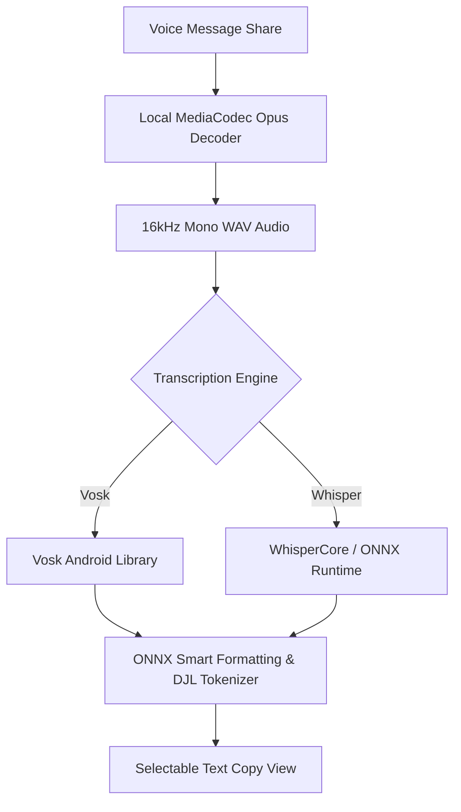
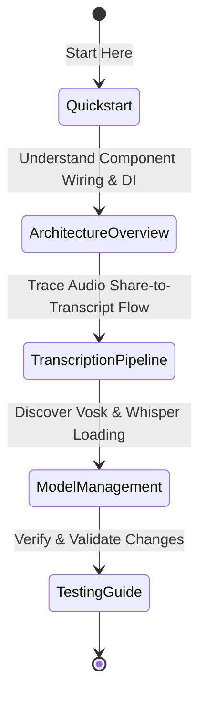

# Quickstart & Developer Map

Welcome to **Ain't Listening**, an offline-first Android application designed to transcribe shared audio files (`.opus` voice messages) 100% locally and privately on-device. By eliminating any reliance on remote servers or cloud API endpoints for transcription, the application guarantees absolute user privacy.

This page serves as the entrypoint for developers and coding agents. It details project setup, build instructions, architectural rules, and provides a task-routing map to navigate the wiki documentation.

---

## High-Level Purpose & Design Philosophy

Ain't Listening is built to resolve a major privacy vulnerability: sending private, informal audio notes to external third-party speech-to-text servers. The app operates with a strict **offline-first local-transcription** architecture:
* **Native Processing:** Decodes audio formats (like Opus) locally via Android's `MediaCodec` and converts them to 16kHz mono WAV on the fly.
* **On-Device Inference:** Performs speech-to-text directly using native libraries—specifically **Vosk Android** (fast, ~40-50MB models) and **Whisper** (high accuracy via ONNX Runtime and WhisperCore).
* **Text Post-Processing:** Applies localized ONNX-based punctuation, formatting, and Hugging Face tokenizers completely on-device.


*Figure 1: High-level local processing pipeline flow in Ain't Listening.*

---

## Developer Hygiene & Privacy Invariants

To maintain our uncompromising privacy commitment, all contributors must strictly adhere to the following developer hygiene and privacy rules:

1. **No External Network-Bound Processing:** Do **not** integrate any cloud-based transcription APIs (e.g., Google Speech-to-Text, OpenAI Whisper API, AWS Transcribe) or external LLM APIs.
2. **No Tracking, Telemetry, or Analytics:** Remote telemetry, crash-reporting SDKs (such as Firebase Crashlytics, Mixpanel, or App Center), or tracking dependencies are strictly prohibited. Crash investigation must be done via standard `logcat` or local diagnostic logs.
3. **Restricted Network Permissions:** Network access is exclusively reserved for downloading offline speech models from verified sources (like `alphacephei.com` and `huggingface.co`). Once models are downloaded, the app must remain fully operational without any internet connection.
4. **Local Database & Storage:** Transcribed text, user preferences, and downloaded models must reside solely in sandboxed internal storage (e.g., Room database, SharedPreferences/DataStore, and internal app files directory).

---

## Prerequisites, Build, and Run Guidelines

The project is built on the modern Android toolchain using Java 17 and Gradle.

### System & SDK Configurations
* **Compile SDK / Target SDK:** `37` (Android 15)
* **Minimum SDK (minSdk):** `29` (Android 10)
* **Java Version Compatibility:** `Java 17` (Source and Target compatibility)
* **ABIs Supported:** `arm64-v8a`, `x86_64` (NDK configuration)

### Build Instructions

1. **Environment Setup:**
   * Open the project in a recent version of Android Studio (e.g., Ladybug, Koala, Jellyfish, or newer).
   * Let Android Studio automatically sync Gradle dependencies.

2. **JNI Shared Library Patching:**
   * The project configures a custom ELF patching task (`patchDjlNativeLibs`) that automatically extracts, patches, and copies native shared libraries (`.so` files for DJL, WhisperCore, ONNX Runtime, and Vosk) during build preparation.
   * This task integrates with Gradle's native packaging step:
     ```groovy
     tasks.configureEach { task ->
         if (task.name.startsWith("merge") && task.name.endsWith("JniLibFolders")) {
             task.dependsOn "patchDjlNativeLibs"
         }
     }
     ```

3. **Running the App:**
   * Build the project and deploy it onto an emulator or physical device running **Android 10 (API Level 29) or higher**.
   * Run via Android Studio's **Run** button or execute the following Gradle command in your terminal:
     ```bash
     ./gradlew installDebug
     ```

---

## Task-Routing Map

Use this directory map to quickly find and navigate to the relevant wiki sections depending on your task.

| Development Task | Key Focus | Wiki Reference |
| :--- | :--- | :--- |
| **Understand App Architecture** | Dependency injection (Dagger Hilt), local database schemas (Room), SharedPreferences / DataStore, and cross-layer state. | [Architecture Overview](architecture/overview.md) |
| **Modify Audio Processing** | Opus audio decoding via native MediaCodec, sample rate conversion to 16kHz WAV, and feeding the audio stream to models. | [Transcription Pipeline Workflow](workflows/transcription-pipeline.md) |
| **Extend Engine / Model Support** | Vosk and Whisper engines, model downloads, language catalog definitions, model file management, extraction, and verification. | [Model Management & Lifecycle](concepts/model-management.md) |
| **Add or Run Tests** | Unit testing setup with Mockito, Espresso instrumentation testing, and validating architectural invariants. | [Testing Guide](testing/guide.md) |

### Context Exploration Flow

If you are a coding agent onboarding to this codebase, we recommend exploring the documentation in the following order:


*Figure 2: Suggested reading order for onboarding developers and coding agents.*
