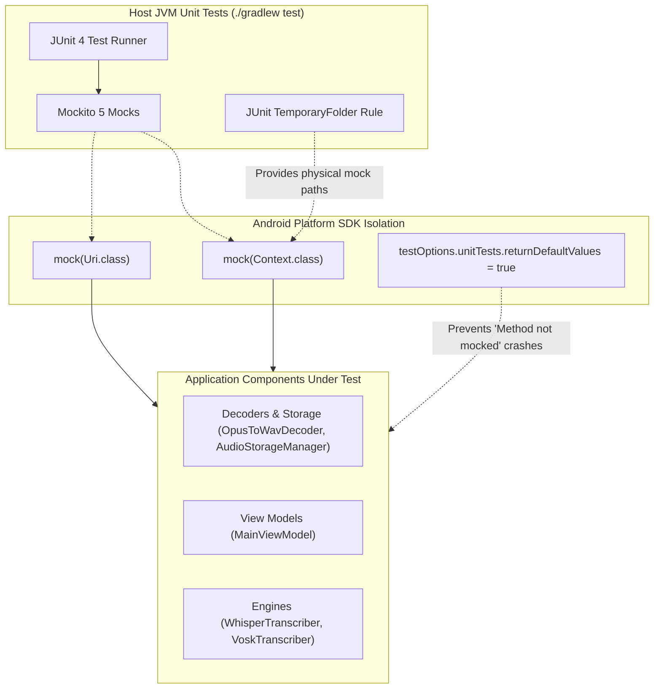

# Testing Guide

This guide outlines the testing strategy, test architecture, directory structure, and execution steps for the **A'int Listening** application. It explains how to verify architectural boundaries, core business logic, and on-device transcription engines without relying on real physical hardware in unit tests.

For a broader understanding of the codebase structure and data persistence layers, see the [Architecture Overview](../architecture/overview.md).

---

## Testing Strategy & Architecture

The testing suite relies on a **host-side JVM unit testing architecture**. To maximize feedback speed, the vast majority of application components are tested locally under JVM environment, mock-integrating with the Android platform rather than running on a real device or emulator.

The system utilizes standard testing libraries configured in Gradle:
- **JUnit 4** as the primary test runner framework.
- **Mockito 5** to stub and verify interfaces, dependencies, and Android SDK classes.
- **AndroidX Architecture Core Testing (`InstantTaskExecutorRule`)** to execute LiveData and ViewModel updates synchronously on the caller's test thread.


The JVM unit testing execution flow, illustrating the isolation of Android framework dependencies.

---

## Handling and Mocking Android Frameworks

When unit testing Android codebases on a local JVM, references to Android platform APIs (such as `android.content.Context`, `android.net.Uri`, or `android.media.MediaCodec`) normally throw `RuntimeException: Method ... not mocked`. A'int Listening addresses this with two complementary strategies:

### 1. Default Value Fallbacks
In `AintListening/build.gradle`, the Android Gradle Plugin configuration sets:
```groovy
testOptions {
    unitTests.returnDefaultValues = true
    unitTests.all {
        jvmArgs '-Dnet.bytebuddy.experimental=true'
    }
}
```
Setting `returnDefaultValues = true` overrides default Android SDK mock behaviors, causing unmocked methods to return default values (`null`, `0`, `false`, or empty values) instead of throwing JVM-halting exceptions. Additionally, `-Dnet.bytebuddy.experimental=true` ensures Mockito functions correctly on newer Java virtual machines.

### 2. Mocking Core Framework Classes
Rather than pulling in heavy simulation frameworks like Robolectric for simple interactions, core platform objects are lightweight-mocked via Mockito or JUnit's built-in file helpers:

*   **`Context` and `Uri` Mocks**: Instantiated directly using `mock(Context.class)` and `mock(Uri.class)`. In situations requiring filesystem operations (e.g., verifying directory retrieval or storage creation), Mockito is instructed to return paths backed by a synchronous JVM `TemporaryFolder`.
    ```java
    @Rule
    public TemporaryFolder temporaryFolder = new TemporaryFolder();

    @Before
    public void setUp() throws IOException {
        Context context = mock(Context.class);
        File cacheDir = temporaryFolder.newFolder("cache");
        File filesDir = temporaryFolder.newFolder("files");

        when(context.getApplicationContext()).thenReturn(context);
        when(context.getCacheDir()).thenReturn(cacheDir);
        when(context.getFilesDir()).thenReturn(filesDir);
    }
    ```
*   **Media APIs (`MediaCodec`, `MediaExtractor`, `MediaFormat`)**: Complex media frameworks are tested through structural black-box verification. For example, when decoding audio using `OpusToWavDecoder`, passing a mocked `Uri` safely causes the underlying `MediaExtractor` call to return false, confirming graceful failure boundaries and exception catching without loading physical media streams.

---

## Test Directory Structure

The unit tests are housed entirely under `AintListening/src/test/java/`, organized cleanly to mirror the main package directory structure under the `de.switchconsulting.aintlistening` package space:

```text
AintListening/src/test/java/de/switchconsulting/aintlistening/
├── AintListeningApplicationTest.java
├── data/
│   ├── AudioStorageManagerTest.java         # Tests cache, storage, and audio-chunk operations
│   ├── DownloadStateTest.java
│   ├── EnumsTest.java
│   ├── LanguageSupportTest.java
│   ├── ModelCatalogRepositoryTest.java
│   ├── ModelCatalogTest.java
│   ├── ModelDownloaderTest.java
│   ├── ModelInfoTest.java
│   ├── PreferencesDataSourceTest.java
│   ├── TranscriptionLocalDataSourceTest.java # Tests DB entities mapping via mocked DAOs
│   ├── TranscriptionProcessorTest.java       # Verifies transcription pipeline parsing
│   └── TranscriptionRepositoryTest.java
├── di/
│   └── AppModuleTest.java
├── formatting/
│   └── SmartFormatterTest.java
├── transcription/
│   ├── TranscriberRegistryTest.java
│   ├── TranscriptionParagraphTest.java
│   ├── VoskTranscriberTest.java              # Asserts Vosk engine metadata and limits
│   └── WhisperTranscriberTest.java           # Asserts Whisper engine capabilities
├── ui/
│   ├── MainUiStateTest.java
│   ├── MainViewModelTest.java                # Verifies LiveData updates using InstantTaskExecutorRule
│   ├── ModelManagementViewModelTest.java
│   └── UiDisplaySettingsTest.java
└── util/
    ├── NetworkUtilsTest.java
    ├── OpusToWavDecoderTest.java             # Tests Opus-to-WAV decoders on mock URIs
    └── WavUtilsTest.java
```

---

## Key Test Coverage Areas

Several unit test files represent vital system domains, serving as core references when adding new features or components:

### 1. Transcription Pipeline (`TranscriptionProcessorTest`)
Located at `AintListening/src/test/java/de/switchconsulting/aintlistening/data/TranscriptionProcessorTest.java`, this file exercises the central `TranscriptionProcessor` pipeline. It verifies:
*   How multiline audio transcription data is parsed into discrete paragraphs (`TranscriptionParagraph` models).
*   Enforcement of smart formatting rules (with or without punctuation engine features enabled).
*   Correct lifecycle handling, confirming that releasing the processor properly terminates internal transcriber registries and background executors.

### 2. Audio Decoders & Filesystem Utilities (`OpusToWavDecoderTest`)
Located at `AintListening/src/test/java/de/switchconsulting/aintlistening/util/OpusToWavDecoderTest.java`, this test asserts media parsing behavior. Alongside `AudioStorageManagerTest`, it guarantees:
*   Robust error containment when passing invalid or empty `Uri` paths (the decoder returns a clean `false` instead of crashing).
*   Synchronous execution of filesystem utility routines on temporary, auto-deleted JVM directories.

### 3. On-Device Engines (`WhisperTranscriberTest` & `VoskTranscriberTest`)
Located under `AintListening/src/test/java/de/switchconsulting/aintlistening/transcription/`, these verify constraints on native transcription backends:
*   **Metadata Checks**: Verifies that the correct `TranscriberType` (VOSK or WHISPER) is reported, and that capabilities like `providesPunctuation()` correctly return `true` for Whisper but `false` for Vosk.
*   **Safety Boundaries**: Confirms that trying to load an unsupported locale (e.g., `Locale.JAPANESE`) or a model that has not been downloaded on-disk immediately raises an `IllegalStateException` on initialization.

---

## Running Tests

Tests can be run either through command-line build tools or from within the official development environment.

### Using Gradle (CLI)
You can execute tests directly from the root of the project repository via the terminal:

*   **Run all unit tests across all modules**:
    ```bash
    ./gradlew test
    ```
*   **Run debug-specific unit tests (standard developer build)**:
    ```bash
    ./gradlew :AintListening:testDebugUnitTest
    ```
*   **Locating Test Reports**:
    Once execution finishes, Gradle generates rich HTML coverage reports. Open the index file in any web browser to view detailed reports:
    ```text
    AintListening/build/reports/tests/testDebugUnitTest/index.html
    ```

### Using Android Studio
Android Studio provides full support for local unit testing:

1.  Open the **Project View** panel on the left.
2.  Navigate to `AintListening` -> `src/test/java`.
3.  **Run entire suite**: Right-click the `de.switchconsulting.aintlistening` package and select **Run 'Tests in 'de.switch...'**.
4.  **Run a single test class or method**: Open a file (e.g., `WhisperTranscriberTest.java`), right-click inside the file body or click the green gutter play icon next to class/method signatures, and click **Run 'WhisperTranscriberTest'**.
5.  View live assertions and trace logs in the integrated **Run Tool Window** at the bottom.
