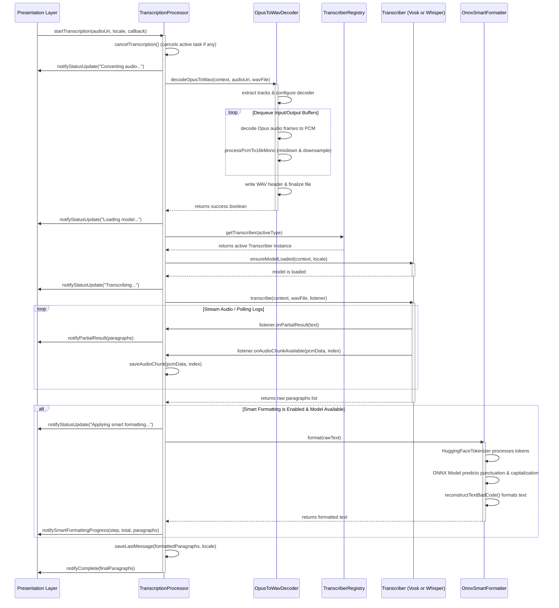

The **Transcription Pipeline** in *A'int Listening* is a fully local, privacy-respecting pipeline responsible for transforming audio recordings (such as shared WhatsApp voice messages) into clean, punctuated, and formatted text paragraphs. By leveraging Android's native hardware-accelerated media decoders alongside state-of-the-art on-device machine learning models (Vosk, Whisper, and ONNX-based formatting), the application provides a seamless, zero-network speech-to-text experience.

---

## End-to-End Transcription Lifecycle

The pipeline is triggered when an audio file is shared with *A'int Listening* (e.g., from an external app like WhatsApp) and concludes when the UI renders the formatted transcription. The execution proceeds through the following phases:


*Figure 1: Sequence diagram of the end-to-end transcription and smart formatting pipeline.*

### Step-by-Step Execution Lifecycle

1. **User Action / Intent Reception**: The user selects an audio message in WhatsApp (or another app) and shares it with *A'int Listening*. The Android OS routes the request to `MainActivity`, which extracts the file's content `Uri`.
2. **Task Initialisation**: `MainActivity` delegates the audio `Uri` and the chosen target `Locale` to the `MainViewModel`, which calls `TranscriptionProcessor.startTranscription()`.
3. **Cancellation of Ongoing Work**: To prevent thread starvation and resource leaks, `TranscriptionProcessor` cancels any active transcription task by calling `cancelTranscription()`, which halts the thread pool's `Future` task and interrupts any ongoing execution.
4. **Audio Decoding and Downsampling**: The input audio file—typically encoded in the high-efficiency, variable-bitrate Opus format (often 48kHz stereo)—is decoded into raw PCM data using native Android codecs. It is concurrently downsampled to the industry-standard speech recognition format: **16kHz sample rate, 1 channel (Mono), 16-bit PCM**, and stored in a temporary WAV file.
5. **Model Initialization**: The processor determines the active speech-to-text engine (either Vosk or Whisper) for the selected locale via `ModelCatalogRepository`. It retrieves the appropriate implementation from the `TranscriberRegistry` and loads the machine learning weights into memory via `ensureModelLoaded()`.
6. **Execution of Speech-to-Text**:
   - The WAV file is streamed or fed into the speech engine.
   - As the engine processes the audio, it sends partial transcriptions to the UI through the `TranscriptionCallback.onPartialResult` callback.
   - For every logical segment or sentence, the raw PCM data is sliced and saved as a discrete `.wav` chunk via `TranscriptionRepository.saveAudioChunk()`. This step creates individual audio files associated with specific text paragraphs, enabling the UI to support segment-by-segment playback.
7. **Smart Formatting Post-Processing**: Once the raw transcription is fully compiled, the pipeline evaluates whether to run the ONNX-based formatting engine. If the model does not natively provide punctuation (e.g., Vosk), the user has enabled formatting in their preferences, and the formatting model is downloaded, the text is processed by `OnnxSmartFormatter`.
8. **Results Persistence**: The final formatted paragraphs, along with references to their saved audio chunks and the chosen locale, are written to local persistence via `TranscriptionRepository.saveLastMessage()`.
9. **UI Rendering**: The `TranscriptionCallback.onComplete` method is called on the main application thread, updating the UI with the final list of `TranscriptionParagraph` objects.

---

## High-Performance Audio Decoding (`OpusToWavDecoder`)

Speech-to-text engines like Vosk and Whisper expect uniform audio parameters. Voice notes shared from WhatsApp or recorded by the system vary widely in sample rates, bitrates, and channels. `OpusToWavDecoder` bridges this gap using hardware-accelerated APIs built into Android.

### Native Decoding Mechanism

Rather than bundling bulky third-party native libraries (like FFmpeg), `OpusToWavDecoder` leverages standard Android SDK media APIs:
- **`MediaExtractor`**: Parses the container file (e.g., `.ogg`, `.m4a`, `.opus`) from the source URI, locates the primary audio track, and extracts encoded media samples.
- **`MediaCodec`**: Initializes the native Android system decoder appropriate for the track's MIME type (e.g., `audio/opus`), turning compressed frames into raw, uncompressed PCM byte buffers.

### PCM Conversion and Downsampling

The decoder processes raw output PCM buffers iteratively. Since Vosk and Whisper require **16kHz, Mono, 16-bit PCM**, any incoming format (such as 48kHz stereo) is dynamically downsampled and mixed down using the `processPcmTo16kMono()` method:

1. **Byte-to-Short Transformation**: The raw output bytes from `MediaCodec` are read as little-endian short values (16-bit samples) using `ByteBuffer.wrap(inputPcm).order(ByteOrder.LITTLE_ENDIAN).asShortBuffer().get(shorts)`.
2. **Downsampling Step Calculation**: The conversion step size is calculated based on the input sample rate:
   $$\text{Step} = \frac{\text{Native Sample Rate}}{\text{Target Sample Rate (16000)}}$$
   For a 48kHz audio file, the step size is exactly $3$.
3. **Channel Mixing (Downmixing)**: To convert multi-channel (Stereo) audio into a single channel (Mono) without losing audio data, the algorithm averages the signal across all native channels at each step:
   $$\text{Sample}_{\text{mono}} = \frac{1}{C} \sum_{c=0}^{C-1} \text{Sample}_{i+c}$$
   Where $C$ represents the input channel count.
4. **Short-to-Byte Reassembly**: The downsampled short array is packaged back into a little-endian byte array and streamed to the temporary output file.

### WAV File Structure and Header Updates

A valid PCM WAV file must start with a 44-byte RIFF header that specifies the file size and audio parameters. Because the exact size of the decoded audio is unknown until decoding completes, the decoder writes a placeholder WAV header first:

```
[0-3]   "RIFF"
[4-7]   Total File Size (placeholder: 0)
[8-11]  "WAVE"
[12-15] "fmt "
[16-19] Subchunk1Size (16 bytes)
[20-21] AudioFormat (1 = PCM)
[22-23] Channels (1 = Mono)
[24-27] SampleRate (16000)
[28-31] ByteRate (SampleRate * Channels * BitsPerSample / 8 = 32000)
[32-33] BlockAlign (Channels * BitsPerSample / 8 = 2)
[34-35] BitsPerSample (16)
[36-39] "data"
[40-43] Data Subchunk Size (placeholder: 0)
```

Once the `MediaCodec` reaches the End-of-Stream (EOS) and all PCM bytes are written to disk, the utility opens the file with a `RandomAccessFile` in read-write (`"rw"`) mode, rewinds to position 0, and overwrites the header with the correct total PCM byte length.

---

## Speech Recognition Engines Execution

The `TranscriptionProcessor` handles transcription execution on a background thread pool, utilizing `TranscriberRegistry` to load the desired engine. *A'int Listening* implements two main transcription engines, each with distinct runtime behaviors and paragraph segmentation logic.

### 1. Vosk Speech Recognition (`VoskTranscriber`)

The Vosk engine is lightweight, extremely fast, and processes streaming buffer feeds synchronously:

* **Engine Attributes**: Does not natively generate punctuation or capitalization (requires post-processing).
* **Execution Flow**:
  - Skips the initial 44-byte WAV header of the pre-processed WAV file.
  - Streams audio in 4096-byte increments into the `Recognizer` using `recognizer.acceptWaveForm(buffer, nread)`.
  - On receiving `true` from `acceptWaveForm()`, a complete spoken segment has been finalized. Vosk outputs a JSON payload containing the finalized segment:
    ```json
    { "text": "transcribed segment text" }
    ```
  - While processing, `recognizer.getPartialResult()` returns a JSON structure containing unfinalized tokens, which are regularly passed to the UI to provide real-time visual feedback:
    ```json
    { "partial": "partial transcribed" }
    ```
* **Audio Chunking**: Because Vosk explicitly signals when a segment is finalized, the transcribing loop buffers the raw PCM data of the current sentence and saves it on finalization. It resets the buffer on each finalized sentence, providing natural segment-level audio files that correspond directly to each transcription paragraph.

### 2. Whisper Speech Recognition (`WhisperTranscriber`)

The Whisper engine runs on top of `whisper.cpp` (wrapped via `whispercore`) and is designed to operate on the complete audio file rather than a raw stream:

* **Engine Attributes**: Natively generates high-quality punctuation and capitalization.
* **Execution Flow**:
  - `WhisperTranscriber` triggers `whisper.transcribeAudioFile(wavFile, true, true)` with timestamps enabled.
  - **Log Polling for Incremental Updates**: Since the underlying `whisper.cpp` engine runs asynchronously, `WhisperTranscriber` polls the engine's message logs every 100 milliseconds. New log lines are parsed on the fly.
* **Timestamp Parsing and Slicing**: Whisper log outputs contain explicit timestamp strings format: `[HH:MM:SS.mmm --> HH:MM:SS.mmm] segment_text`.
  - The transcriber parses these strings using regex to extract millisecond intervals.
  - **Silence Gap & Paragraph Segmentation**: It monitors silence gaps between consecutive segments. If a pause exceeds `SILENCE_GAP_MS` (100ms) and the current segment ends with sentence-terminating punctuation (e.g., `.`, `?`, `!`), or if the paragraph text grows larger than 400 characters and ends with a sentence terminator, the engine finalized the paragraph.
  - **PCM Slicing**: To isolate the audio for the paragraph, the engine computes the file offsets:
    $$\text{Byte Offset} = 44 + (\text{Timestamp}_{\text{ms}} \times 32)$$
    *(Since 16kHz, 16-bit Mono PCM produces exactly 32 bytes per millisecond).*
    Using a `RandomAccessFile`, the precise range of bytes is copied from the master WAV file and stored as a separate chunk file.

---

## ONNX Smart Formatting Engine

If the active transcriber does not natively output punctuation (such as Vosk) and the user has activated smart formatting, the raw, lowercase text is processed by `OnnxSmartFormatter`. This component utilizes **Hugging Face Tokenizers** alongside the **ONNX Runtime** to predict sentence boundaries, punctuation, and capitalization.

### The 1-800-BAD-CODE Architecture

The smart formatter uses a specialized sequence-tagging model designed for local on-device punctuation restoration.

#### 1. Tokenization
The raw text is first converted to lowercased text (based on the model's locale) and tokenized using `HuggingFaceTokenizer` loaded from `tokenizer.json`. The tokenizer processes the string into integer token IDs, an attention mask, and sub-word string tokens (using the SentencePiece convention, where new words are prefixed with a space character ` ` or `\u2581`).

#### 2. Model Inference
The token IDs and attention masks are wrapped in `OnnxTensor` buffers and fed into the ONNX session. The model processes the tokens and outputs four prediction tensors via dedicated heads:
* **`pre_preds`**: An array of predictions mapping to `PRE_PUNC_LABELS = {"", "¿", "¡"}`. These represent pre-word punctuation (used in languages like Spanish).
* **`post_preds`**: An array of predictions mapping to `POST_PUNC_LABELS`:
  ```java
  {"", "", ".", ",", "?", "？", "，", "。", "、", "・", "।", "؟", "፣", ";", "።", "፣", "፧"}
  ```
* **`cap_preds`**: A character-level capitalization tensor of binary flags indicating which individual characters inside a token should be capitalized.
* **`seg_preds` (or `sbd_preds`)**: A sentence-boundary detection tensor of binary flags, indicating if a token marks the end of a sentence.

### The Reconstruction Algorithm

The `reconstructTextBadCode()` method integrates these multi-head predictions into a final formatted string:

```
  For each sub-token in the token stream:
    If token is a special token (e.g., <s>, </s>, [CLS]):
        Skip token.
    
    If token starts a new word (starts with ' ' or '\u2581'):
        1. Accumulate all subsequent sub-tokens that belong to this word.
        2. Apply character-level capitalization from cap_preds:
           - Capitalize the character if its cap_preds flag is 1, or if a preceding space was marked for capitalization.
           - Capitalize the first letter of the word if a sentence-boundary or punctuation forced capitalization.
        3. Identify acronyms:
           - If post_preds equals 1 (POST_PUNC_ACRONYM_INDEX), the word is an acronym (e.g., "U.S.A.").
           - Format by appending a period after every letter.
        4. Apply pre-punctuation (e.g., "¿") to the start of the word if predicted.
        5. Apply post-punctuation (e.g., "?") to the end of the word if predicted.
        6. If post-punctuation is a sentence-ending character ('.', '?', ':') or if sentence boundary detection (sbd_preds) is 1:
           - Set a flag to force-capitalize the first character of the next word.
        7. Append the fully assembled word to the output string, separating words with single spaces.
```

---

## Pipeline Invariants, Failures, and Fallbacks

To ensure robustness in resource-constrained mobile environments, the transcription pipeline maintains several strict design invariants and defensive fallbacks:

* **Task Thread-Safety**: All entry-point operations in `TranscriptionProcessor` are synchronized. Starting a new transcription guarantees that any prior task is cancelled via `Future.cancel(true)` and native decoders are safely released before reclaiming resources.
* **Low Memory Footprint**: Rather than decoding an entire large audio file into RAM, `OpusToWavDecoder` streams input buffers through the native `MediaCodec` decoder directly into file storage on disk.
* **Smart Formatting Fallback**: If `OnnxSmartFormatter` fails to initialize or encounters an out-of-memory exception during inference, the pipeline logs the error, discards the half-processed formatting state, and falls back to saving the raw, unpunctuated text paragraphs. This ensures the user's transcript is never lost.
* **Vosk / Whisper Resiliency**: When model loading fails due to corrupted files, the UI is notified via the `onError()` callback, allowing the user to reinstall or redownload the model without crashing the application.

---

## See Also

* [Architecture Overview](../architecture/overview.md) — The three-layer architecture and local persistence layers.
* [Model Management](../concepts/model-management.md) — How the app manages and downloads Vosk, Whisper, and ONNX models on-device.
* [Quickstart](../quickstart.md) — Getting started with the codebase and local execution.
